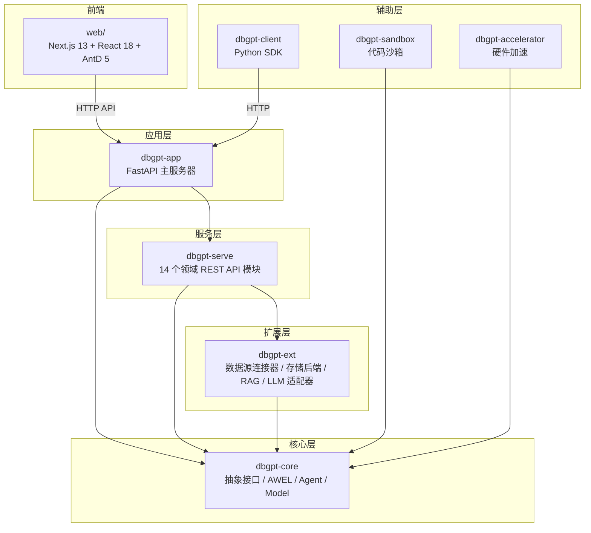
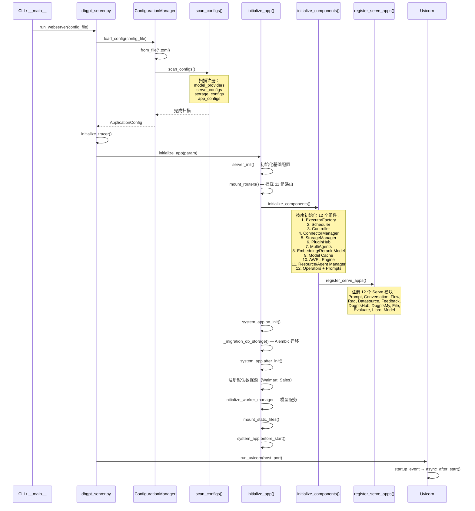
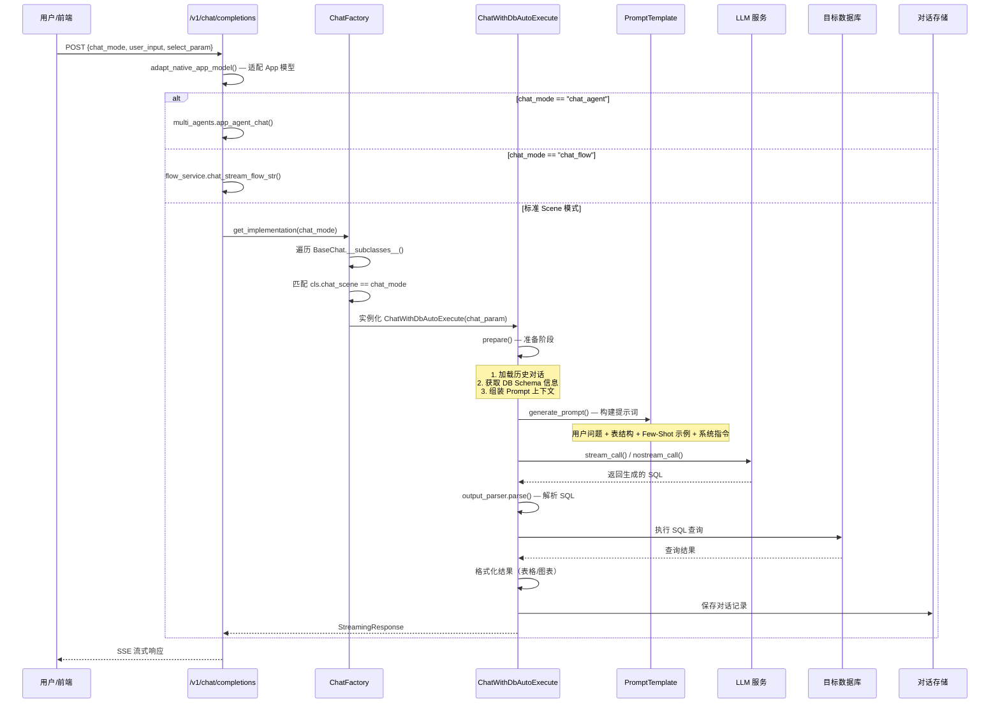
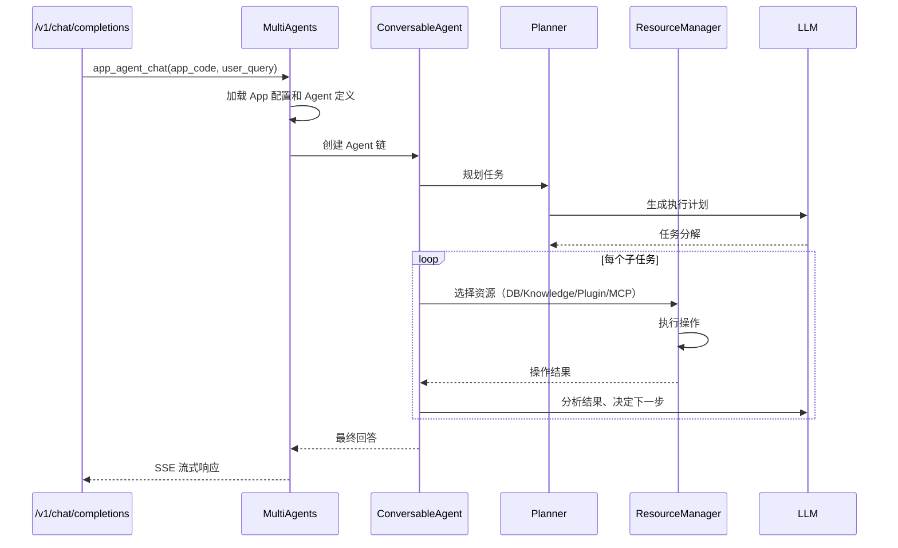
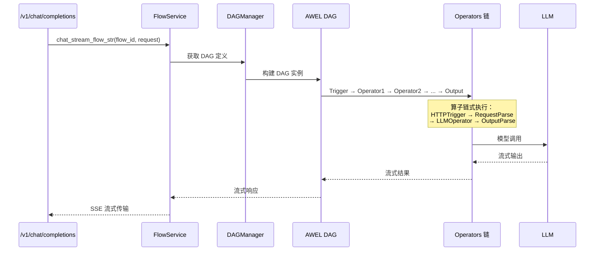
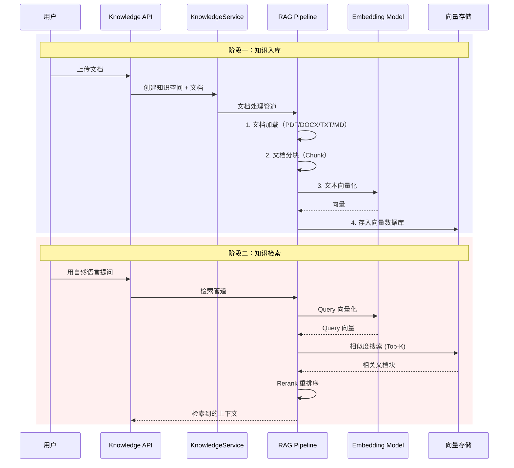

# DB-GPT 项目代码架构深度分析 & 二次开发指南

## 目录

1. [整体架构概览](#1-整体架构概览)
2. [核心启动流程](#2-核心启动流程)
3. [分层架构详解](#3-分层架构详解)
4. [核心业务流程](#4-核心业务流程)
5. [关键子系统深度解析](#5-关键子系统深度解析)
6. [二次开发指南](#6-二次开发指南)
7. [开发环境搭建](#7-开发环境搭建)

---

## 1. 整体架构概览

### 1.1 Monorepo 分层架构

DB-GPT 采用 **uv 工作区管理的 Monorepo** 架构，分为 7 个独立包，每层职责清晰：



### 1.2 各包职责速查

| 包名 | 路径 | 核心职责 |
|------|------|---------|
| **dbgpt-core** | `packages/dbgpt-core/` | 核心抽象层：AWEL DAG 引擎、LLM/Embedding 接口、Agent 框架、存储 API、组件生命周期系统、CLI |
| **dbgpt-app** | `packages/dbgpt-app/` | 应用入口：FastAPI 服务器、ChatScene 场景系统、组件编排、OpenAPI 端点、数据库迁移 |
| **dbgpt-ext** | `packages/dbgpt-ext/` | 具体实现：14+ 数据库连接器、向量存储（Chroma/Milvus）、RAG 管道、LLM 适配器（OpenAI/DeepSeek 等） |
| **dbgpt-serve** | `packages/dbgpt-serve/` | REST API 层：14 个独立服务模块（Agent、Conversation、Datasource、Flow、Model、Prompt、RAG、File 等） |
| **dbgpt-client** | `packages/dbgpt-client/` | Python SDK：类型化的异步客户端方法 |
| **dbgpt-sandbox** | `packages/dbgpt-sandbox/` | 安全代码执行：隔离运行 Python/JS 代码 |
| **dbgpt-accelerator** | `packages/dbgpt-accelerator/` | 硬件加速：自动 GPU 检测、Flash Attention |

### 1.3 依赖关系原则

```
上层 → 下层（单向依赖）
app → serve → core ← ext
         ↓
        core（所有层都依赖 core）
```

> [!IMPORTANT]
> **依赖倒置原则**：`dbgpt-core` 定义抽象接口，`dbgpt-ext` 提供具体实现。上层代码只依赖 core 中的抽象，不直接依赖 ext 中的具体实现类。

---

## 2. 核心启动流程

### 2.1 服务启动时序

启动入口：[dbgpt_server.py](file:///Users/yujiahong/Documents/GitHub/py-workspace/chatbi-workspace/DB-GPT-main/packages/dbgpt-app/src/dbgpt_app/dbgpt_server.py)



### 2.2 组件生命周期

[component.py](file:///Users/yujiahong/Documents/GitHub/py-workspace/chatbi-workspace/DB-GPT-main/packages/dbgpt-core/src/dbgpt/component.py) 定义了核心的 `SystemApp` + `BaseComponent` + `LifeCycle` 三层体系：

```
LifeCycle 钩子执行顺序:
  1. on_init()         — 组件初始化（注册后立即）
  2. after_init()      — 初始化后（数据库连接在此建立）
  3. before_start()    — 启动前
  4. after_start()     — 启动后（ASGI startup 事件触发）
  5. before_stop()     — 停止前（ASGI shutdown 事件触发）
```

**组件注册表** (`ComponentType` 枚举)：

| 组件类型 | 枚举值 | 职责 |
|---------|--------|------|
| `WORKER_MANAGER` | 模型工作管理器 | 管理模型推理 Worker |
| `MODEL_CONTROLLER` | 模型控制器 | 模型路由和负载均衡 |
| `CONNECTOR_MANAGER` | 连接器管理器 | 管理数据库连接 |
| `AWEL_DAG_MANAGER` | DAG 管理器 | 管理 AWEL 工作流 |
| `AWEL_TRIGGER_MANAGER` | 触发器管理器 | 管理工作流触发事件 |
| `RAG_STORAGE_MANAGER` | RAG 存储管理器 | 管理向量存储 |
| `AGENT_MANAGER` | 智能体管理器 | 管理 Agent 生命周期 |
| `RESOURCE_MANAGER` | 资源管理器 | 管理 Agent 可用资源 |
| `FILE_STORAGE_CLIENT` | 文件存储客户端 | 文件上传/下载 |

### 2.3 配置系统

```
configs/
├── dbgpt-proxy-openai.toml       # OpenAI 代理模式
├── dbgpt-proxy-deepseek.toml     # DeepSeek 代理模式
├── dbgpt-proxy-siliconflow.toml  # SiliconFlow 代理模式
├── dbgpt-local-vllm.toml         # 本地 vLLM 部署
└── ...
```

配置使用 TOML 格式，支持环境变量插值 `${env:VAR_NAME:-默认值}`，通过 `ConfigurationManager.from_file()` 加载并解析为 `ApplicationConfig` 对象。

---

## 3. 分层架构详解

### 3.1 应用层 (dbgpt-app)

```
dbgpt_app/
├── dbgpt_server.py          # 【入口】FastAPI 应用创建、初始化、启动
├── component_configs.py     # 【编排】12 个组件的初始化和注册逻辑
├── config.py                # ApplicationConfig 数据模型
├── base.py                  # server_init、数据库迁移
├── _cli.py                  # CLI 命令行接口
│
├── openapi/                 # REST API 端点
│   ├── api_v1/
│   │   ├── api_v1.py        # 【核心】对话/数据库/文件/模型 API
│   │   ├── agentic_data_api.py  # Agent 数据 API
│   │   ├── examples_api.py  # 示例 API
│   │   ├── python_upload_api.py # Python 上传 API
│   │   ├── editor/          # SQL 编辑器 API
│   │   └── feedback/        # 反馈 API
│   └── api_v2.py            # V2 版本 API
│
├── scene/                   # 【核心】对话场景系统
│   ├── base.py              # ChatScene 枚举、AppScenePromptTemplateAdapter
│   ├── base_chat.py         # BaseChat 抽象基类（30KB 核心逻辑）
│   ├── chat_factory.py      # ChatFactory 工厂（Singleton）
│   ├── chat_normal/         # 普通对话场景
│   ├── chat_db/             # 数据库对话场景（auto_execute + professional_qa）
│   ├── chat_dashboard/      # 报表仪表盘场景
│   ├── chat_data/           # 数据分析场景（Excel）
│   ├── chat_knowledge/      # 知识库对话场景
│   └── operators/           # 场景相关算子
│
├── initialization/          # 初始化模块
│   ├── serve_initialization.py  # Serve 模块扫描与注册
│   ├── app_initialization.py    # App 配置扫描
│   ├── embedding_component.py   # Embedding 模型初始化
│   └── scheduler.py             # 定时任务调度器
│
├── knowledge/               # 知识库管理
│   ├── api.py               # 知识库 REST API
│   └── service.py           # 知识库服务逻辑
│
└── operators/               # AWEL 算子
```

### 3.2 核心层 (dbgpt-core)

```
dbgpt/
├── component.py             # 【核心】SystemApp + BaseComponent + LifeCycle
│
├── core/                    # 核心抽象
│   ├── awel/                # 【核心】AWEL 工作流引擎
│   │   ├── dag/             # DAG 图管理器
│   │   ├── operators/       # 内置算子（LLM、映射、流式等）
│   │   ├── trigger/         # HTTP/调度触发器
│   │   ├── flow/            # 可视化 Flow 注册
│   │   ├── runner/          # 任务运行器
│   │   ├── task/            # 任务抽象
│   │   └── resource/        # 资源管理
│   ├── interface/           # 核心接口（LLM、Embedding、Message、File）
│   ├── operators/           # 通用算子
│   └── schema/              # API Schema（OpenAI 兼容格式）
│
├── agent/                   # Agent 智能体框架
│   ├── core/                # Agent 核心（ConversableAgent、Memory、Planning）
│   ├── expand/              # 扩展 Agent（CodeAssistant、SQL、Summary 等）
│   ├── resource/            # 资源管理（Tool、Knowledge、DB 等）
│   ├── middleware/           # Agent 中间件
│   └── skill/               # 技能管理
│
├── model/                   # 模型管理
│   ├── cluster/             # 模型集群（Controller、Worker、Registry）
│   ├── proxy/               # 代理模型（调用远程 API）
│   └── operators/           # 模型相关算子
│
├── rag/                     # RAG 抽象
│   ├── assembler/           # 文档组装器
│   ├── chunk_manager.py     # 文档分块
│   ├── embedding/           # Embedding 抽象
│   ├── retriever/           # 检索器抽象
│   └── extractor/           # 信息提取器
│
├── datasource/              # 数据源抽象
│   ├── base.py              # BaseConnector 基类
│   └── db_conn_info.py      # 连接信息模型
│
├── storage/                 # 存储抽象
│   ├── vector_store/        # 向量存储接口
│   ├── cache/               # 缓存接口
│   ├── metadata/            # 元数据存储
│   └── graph_store/         # 图存储接口
│
└── vis/                     # 可视化组件
```

### 3.3 扩展层 (dbgpt-ext)

```
dbgpt_ext/
├── datasource/              # 数据库连接器实现
│   ├── rdbms/               # 关系型数据库
│   │   ├── conn_mysql.py
│   │   ├── conn_postgresql.py
│   │   ├── conn_sqlite.py
│   │   ├── conn_mssql.py
│   │   ├── conn_clickhouse.py
│   │   ├── conn_doris.py
│   │   ├── conn_starrocks.py
│   │   ├── conn_hive.py
│   │   └── conn_duckdb.py
│   ├── nosql/               # NoSQL 数据库
│   ├── conn_neo4j.py        # 图数据库
│   ├── conn_spark.py        # Spark
│   └── conn_tugraph.py      # TuGraph
│
├── llms/                    # LLM 适配器
│   ├── proxy/               # 代理模式适配器
│   │   ├── openai.py
│   │   ├── deepseek.py
│   │   ├── claude.py
│   │   ├── gemini.py
│   │   └── ...
│   └── local/               # 本地模型适配器
│
├── rag/                     # RAG 实现
│   ├── assembler/           # 具体组装器
│   ├── retriever/           # 具体检索器
│   └── embedding/           # Embedding 实现
│
└── storage/                 # 存储后端实现
    ├── vector_store/
    │   ├── chroma_store.py
    │   ├── milvus_store.py
    │   ├── elasticsearch_store.py
    │   └── ...
    ├── graph_store/
    └── full_text/
```

### 3.4 服务层 (dbgpt-serve)

每个 Serve 模块遵循统一的目录结构模式：

```
dbgpt_serve/<module>/
├── config.py           # ServeConfig（配置数据模型）
├── serve.py            # Serve 类（BaseComponent 子类，注册路由和服务）
├── api/                # FastAPI Router 端点
│   └── endpoints.py
├── service/            # 业务逻辑层
│   └── service.py
├── models/             # SQLAlchemy ORM 模型
│   └── models.py
├── operators.py        # AWEL 算子
├── dependencies.py     # 依赖注入
└── tests/              # 单元测试
```

**14 个 Serve 模块：**

| 模块 | 路径 | 功能 |
|------|------|------|
| `agent` | `dbgpt_serve/agent/` | Agent 管理、App 管理、推荐问题 |
| `conversation` | `dbgpt_serve/conversation/` | 对话历史管理 |
| `datasource` | `dbgpt_serve/datasource/` | 数据源连接管理 |
| `flow` | `dbgpt_serve/flow/` | AWEL Flow 工作流管理 |
| `model` | `dbgpt_serve/model/` | 模型管理和模型类型 |
| `prompt` | `dbgpt_serve/prompt/` | Prompt 模板管理 |
| `rag` | `dbgpt_serve/rag/` | 知识库/RAG 管理 |
| `file` | `dbgpt_serve/file/` | 文件存储管理 |
| `evaluate` | `dbgpt_serve/evaluate/` | 评估和基准测试 |
| `feedback` | `dbgpt_serve/feedback/` | 用户反馈 |
| `dbgpts/hub` | `dbgpt_serve/dbgpts/hub/` | 插件市场 |
| `dbgpts/my` | `dbgpt_serve/dbgpts/my/` | 我的插件 |
| `libro` | `dbgpt_serve/libro/` | Notebook 交互 |
| `core` | `dbgpt_serve/core/` | Serve 基础设施（BaseServe、异常处理） |

---

## 4. 核心业务流程

### 4.1 对话请求完整流程（Text2SQL 场景）



### 4.2 ChatScene 场景系统

[base.py](file:///Users/yujiahong/Documents/GitHub/py-workspace/chatbi-workspace/DB-GPT-main/packages/dbgpt-app/src/dbgpt_app/scene/base.py) 定义了 **枚举驱动的场景路由**：

| 场景 | Code | 实现类 | 功能 |
|------|------|-------|------|
| `ChatWithDbExecute` | `chat_with_db_execute` | `ChatWithDbAutoExecute` | 自然语言→SQL→自动执行→返回结果 |
| `ChatWithDbQA` | `chat_with_db_qa` | `ChatWithDbQA` | 基于数据库元数据的专业问答 |
| `ChatExcel` | `chat_excel` | `ChatExcel` | Excel/CSV 文件数据分析 |
| `ChatKnowledge` | `chat_knowledge` | `ChatKnowledge` | 知识库 RAG 对话 |
| `ChatDashboard` | `chat_dashboard` | `ChatDashboard` | 自动生成数据仪表盘 |
| `ChatNormal` | `chat_normal` | `ChatNormal` | 普通 LLM 对话 |
| `ChatAgent` | `chat_agent` | MultiAgents | Agent 多轮协作 |
| `ChatFlow` | `chat_flow` | FlowService | AWEL 工作流对话 |

**场景路由关键逻辑**（[chat_factory.py](file:///Users/yujiahong/Documents/GitHub/py-workspace/chatbi-workspace/DB-GPT-main/packages/dbgpt-app/src/dbgpt_app/scene/chat_factory.py)）：

```python
class ChatFactory(metaclass=Singleton):
    def get_implementation(chat_mode, system_app, chat_param):
        # 1. 懒加载所有场景的 Chat 类和 Prompt
        # 2. 遍历 BaseChat.__subclasses__() 
        # 3. 匹配 cls.chat_scene == chat_mode
        # 4. 实例化并返回
```

### 4.3 Agent 智能体对话流程



### 4.4 AWEL Flow 工作流对话流程



### 4.5 知识库 RAG 流程



---

## 5. 关键子系统深度解析

### 5.1 AWEL 工作流引擎

**位置**：`packages/dbgpt-core/src/dbgpt/core/awel/`

AWEL（Agentic Workflow Expression Language）是 DB-GPT 的声明式 DAG 工作流引擎：

```
awel/
├── dag/                 # DAG 图管理
│   ├── base.py          # DAGNode、DAGContext 基类
│   └── dag_manager.py   # DAGManager 组件
├── operators/           # 内置算子
│   ├── base.py          # BaseOperator
│   ├── stream_operator.py   # 流式算子
│   ├── common_operator.py   # 通用算子（Map/Reduce/Join）
│   └── llm_operator.py      # LLM 调用算子
├── trigger/             # 触发器
│   ├── http_trigger.py  # HTTP 触发器
│   └── schedule_trigger.py # 定时触发器
├── flow/                # 可视化 Flow
│   ├── base.py          # Flow 注册和发现
│   └── flow_factory.py  # Flow 工厂
├── runner/              # 任务运行器
├── task/                # 任务抽象
├── resource/            # 资源定义
└── util/                # 工具函数
```

**核心概念：**
- **DAG**：有向无环图，定义算子执行拓扑
- **Operator**：工作流节点，实现 `_do_run` 方法
- **Trigger**：DAG 入口点（HTTP 请求、定时任务）
- **Flow**：可视化编排的 DAG，可通过 Web UI 拖拽设计

### 5.2 Agent 智能体框架

**位置**：`packages/dbgpt-core/src/dbgpt/agent/`

```
agent/
├── core/
│   ├── agent.py              # Agent 基类
│   ├── base_agent.py         # ConversableAgent
│   ├── memory/               # Agent 记忆系统
│   ├── plan/                 # 任务规划器
│   └── schema.py             # Agent Schema
├── expand/
│   ├── code_assistant_agent.py   # 代码助手
│   ├── data_scientist_agent.py   # 数据科学家
│   ├── summary_assistant_agent.py # 摘要助手
│   ├── actions/              # Agent 动作
│   │   ├── chart_action.py   # 图表生成
│   │   ├── code_action.py    # 代码执行
│   │   └── react_action.py   # ReAct 推理
│   └── resources/            # 扩展资源
│       ├── search_tool.py    # 搜索工具
│       ├── host_tool.py      # 系统工具
│       └── dbgpt_tool.py     # DB-GPT 内部工具
├── resource/
│   ├── base.py               # ResourceType 枚举
│   ├── manage.py             # ResourceManager
│   ├── tool/                 # Tool 资源
│   ├── knowledge.py          # 知识库资源
│   └── database.py           # 数据库资源
└── skill/
    └── manage.py             # SkillManager
```

**资源类型：**

| 类型 | 说明 | 来源 |
|------|------|------|
| `Tool` | 函数工具、插件 | PluginToolPack, MCPSSEToolPack |
| `Knowledge` | 知识库检索 | KnowledgeSpaceRetrieverResource |
| `Database` | 数据源操作 | DatasourceResource |
| `App` | 嵌套应用调用 | GptAppResource |
| `Skill` | 可复用技能 | SkillResource |

### 5.3 模型管理集群

**位置**：`packages/dbgpt-core/src/dbgpt/model/cluster/`

```
model/cluster/
├── controller/
│   └── controller.py     # ModelController — 模型路由和注册
├── worker/
│   ├── manager.py        # WorkerManager — 模型 Worker 生命周期
│   └── default_worker.py # DefaultModelWorker — 默认推理 Worker
├── registry/
│   └── registry.py       # ModelRegistry — 模型实例注册表
└── client.py             # Client SDK
```

**两种部署模式：**

1. **统一部署**（`light=false`）：所有模型和服务在同一进程
2. **轻量模式**（`light=true`）：Web 服务器通过 `controller_addr` 连接远程模型

### 5.4 数据源管理

**连接器继承体系：**

```
BaseConnector (dbgpt-core)
  └── RDBMSConnector (dbgpt-ext)
       ├── MySQLConnector
       ├── PostgreSQLConnector
       ├── SQLiteConnector
       ├── MSSQLConnector
       ├── ClickHouseConnector
       ├── DorisConnector
       ├── StarRocksConnector
       ├── HiveConnector
       └── DuckDBConnector
  └── NoSQLConnector
       └── MongoDBConnector
  └── Neo4jConnector
  └── SparkConnector
  └── TuGraphConnector
```

**ConnectorManager** (`dbgpt_serve/datasource/`)：
- 管理所有数据库连接的生命周期
- 提供 `get_connector(db_name)` 统一获取接口
- 支持连接池和连接测试

### 5.5 Serve 模块内部结构

以 **Conversation Serve** 为例解析标准模式：

```
conversation/
├── config.py              # ServeConfig（default_model 等）
├── serve.py               # Serve 类
│   └── init_app():        # 注册路由、初始化服务
├── api/
│   └── endpoints.py       # REST API
│       ├── GET  /new          — 创建对话
│       ├── GET  /list         — 对话列表
│       ├── POST /delete       — 删除对话
│       └── GET  /messages     — 获取消息
├── service/
│   └── service.py         # 业务逻辑
│       ├── create_conversation()
│       ├── get_conversations()
│       ├── get_history_messages()
│       └── delete_conversation()
├── models/
│   └── models.py          # ORM 模型
│       ├── ConversationEntity
│       └── MessageEntity
└── operators.py           # AWEL 算子集成
```

---

## 6. 二次开发指南

### 6.1 添加新的对话场景（ChatScene）

这是最常见的二次开发需求。按以下步骤操作：

**第 1 步：定义场景枚举**

在 [scene/base.py](file:///Users/yujiahong/Documents/GitHub/py-workspace/chatbi-workspace/DB-GPT-main/packages/dbgpt-app/src/dbgpt_app/scene/base.py) 中添加：

```python
class ChatScene(Enum):
    # ... 现有场景 ...
    
    # 新增：自定义报表分析场景
    ChatCustomReport = Scene(
        code="chat_custom_report",
        name="Custom Report",
        describe="Generate custom business reports from data.",
        param_types=["DB Select"],
    )
```

**第 2 步：创建场景目录**

```
scene/chat_custom_report/
├── __init__.py
├── chat.py          # 场景实现类
├── prompt.py        # Prompt 模板
└── out_parser.py    # 输出解析器
```

**第 3 步：实现 Chat 类**

```python
# scene/chat_custom_report/chat.py
from dbgpt_app.scene.base_chat import BaseChat, ChatParam

class ChatCustomReport(BaseChat):
    chat_scene = "chat_custom_report"        # 必须匹配枚举值
    chat_type = "custom_report"
    
    def __init__(self, chat_param: ChatParam, **kwargs):
        super().__init__(chat_param=chat_param, **kwargs)
        # 自定义初始化逻辑
        
    async def prepare(self):
        """准备阶段：获取数据库 Schema、构建上下文"""
        # 获取选择的数据库连接
        # 查询表结构信息
        # 加载历史对话
        pass
    
    async def generate_input_values(self):
        """生成 Prompt 输入变量"""
        return {
            "db_name": self.db_name,
            "table_info": self.table_info,
            "user_input": self.current_user_input,
        }
```

**第 4 步：定义 Prompt 模板**

```python
# scene/chat_custom_report/prompt.py
from dbgpt._private.config import Config
from dbgpt.core import ChatPromptTemplate, HumanPromptTemplate, SystemPromptTemplate
from dbgpt_app.scene.base import AppScenePromptTemplateAdapter
from dbgpt_app.scene.chat_custom_report.out_parser import CustomReportOutputParser

CFG = Config()

PROMPT_SCENE_DEFINE = """You are a professional data analyst..."""

_DEFAULT_TEMPLATE = """
Based on the following table structure:
{table_info}

Please generate a comprehensive report for the user's request:
{user_input}
"""

prompt = AppScenePromptTemplateAdapter(
    prompt=ChatPromptTemplate(
        messages=[
            SystemPromptTemplate.from_template(PROMPT_SCENE_DEFINE),
            HumanPromptTemplate.from_template(_DEFAULT_TEMPLATE),
        ]
    ),
    template_scene="chat_custom_report",
    stream_out=True,
    output_parser=CustomReportOutputParser(),
)

# 注册到全局 Prompt 注册表
CFG.prompt_template_registry.register(prompt, language=CFG.LANGUAGE)
```

**第 5 步：在 ChatFactory 中注册**

在 [chat_factory.py](file:///Users/yujiahong/Documents/GitHub/py-workspace/chatbi-workspace/DB-GPT-main/packages/dbgpt-app/src/dbgpt_app/scene/chat_factory.py) 的 `get_implementation` 方法中添加惰性导入：

```python
from dbgpt_app.scene.chat_custom_report.chat import ChatCustomReport  # noqa
from dbgpt_app.scene.chat_custom_report.prompt import prompt  # noqa
```

---

### 6.2 添加新的 LLM 提供商

**第 1 步：在 dbgpt-ext 中实现适配器**

```python
# packages/dbgpt-ext/src/dbgpt_ext/llms/proxy/my_provider.py
from dbgpt.model.proxy.llms.chatgpt import OpenAILLMClient

class MyProviderLLMClient(OpenAILLMClient):
    """自定义 LLM 提供商适配器"""
    
    def __init__(self, api_key: str, api_base: str = "https://api.myprovider.com/v1"):
        super().__init__(
            api_key=api_key,
            api_base=api_base,
            model_alias="my_provider_proxyllm",
        )
```

**第 2 步：添加可选依赖**

在 `packages/dbgpt-ext/pyproject.toml` 中添加：

```toml
[project.optional-dependencies]
proxy_myprovider = ["httpx>=0.25.0"]
```

**第 3 步：创建配置模板**

```toml
# configs/dbgpt-proxy-myprovider.toml
[models]
[[models.llms]]
model_name = "my_provider_proxyllm"
model_type = "proxy"
proxy_server_url = "${env:MYPROVIDER_API_BASE:-https://api.myprovider.com/v1}"
proxy_api_key = "${env:MYPROVIDER_API_KEY}"
```

---

### 6.3 添加新的数据库连接器

**第 1 步：继承 RDBMSConnector**

```python
# packages/dbgpt-ext/src/dbgpt_ext/datasource/rdbms/conn_mydb.py
from dbgpt_ext.datasource.rdbms.base import RDBMSConnector

class MyDBConnector(RDBMSConnector):
    db_type = "mydb"
    db_dialect = "mydb"
    driver = "mydb+pyodbc"
    
    @classmethod
    def from_uri_db(cls, host, port, user, pwd, db_name, **kwargs):
        db_url = f"{cls.driver}://{user}:{pwd}@{host}:{port}/{db_name}"
        return cls(engine_args={"url": db_url})
    
    def get_table_names(self):
        """获取所有表名"""
        # 实现查询逻辑
        pass
    
    def get_columns(self, table_name):
        """获取表的列信息"""
        pass
    
    def get_indexes(self, table_name):
        """获取索引信息"""
        pass
```

**第 2 步：在 ConnectorManager 中注册**

扫描发现机制会自动识别 `RDBMSConnector` 的子类。

---

### 6.4 添加新的 Serve API 模块

**第 1 步：创建模块目录**

```
packages/dbgpt-serve/src/dbgpt_serve/my_module/
├── __init__.py
├── config.py           # ServeConfig
├── serve.py            # Serve 组件
├── api/
│   └── endpoints.py    # REST API
├── service/
│   └── service.py      # 业务逻辑
├── models/
│   └── models.py       # ORM 模型
└── tests/
```

**第 2 步：定义配置**

```python
# config.py
from dbgpt_serve.core import BaseServeConfig

class ServeConfig(BaseServeConfig):
    __type__ = "dbgpt_serve_my_module"
    
    my_param: str = "default_value"
```

**第 3 步：实现 Serve 类**

```python
# serve.py
from dbgpt.component import BaseComponent, SystemApp
from dbgpt_serve.core import BaseServe

class Serve(BaseServe):
    name = "dbgpt_serve_my_module"
    
    def __init__(self, system_app: SystemApp, config: ServeConfig = None, **kwargs):
        super().__init__(system_app)
        self._config = config
    
    def init_app(self, system_app: SystemApp):
        self._system_app = system_app
        
    def on_init(self):
        """注册路由"""
        from .api.endpoints import router
        self._system_app.app.include_router(
            router, prefix="/api/v2/serve/my_module", tags=["MyModule"]
        )
```

**第 4 步：在 serve_initialization.py 中注册**

在 [serve_initialization.py](file:///Users/yujiahong/Documents/GitHub/py-workspace/chatbi-workspace/DB-GPT-main/packages/dbgpt-app/src/dbgpt_app/initialization/serve_initialization.py) 的 `register_serve_apps()` 中添加：

```python
from dbgpt_serve.my_module.serve import Serve as MyModuleServe

system_app.register(
    MyModuleServe,
    config=get_config(serve_configs, MyModuleServe.name, ...),
)
```

并在 `scan_serve_configs()` 的 modules 列表中添加 `"dbgpt_serve.my_module"`。

---

### 6.5 添加新的 AWEL 算子

```python
# packages/dbgpt-app/src/dbgpt_app/operators/my_operator.py
from dbgpt.core.awel import MapOperator
from dbgpt.core.awel.flow import ViewMetadata, OperatorCategory

class MyCustomOperator(MapOperator[str, str]):
    """自定义算子 — 在 AWEL Flow 可视化编辑器中可见"""
    
    metadata = ViewMetadata(
        label="My Custom Operator",
        name="my_custom_operator",
        category=OperatorCategory.COMMON,
        description="Does something cool with the input.",
    )
    
    async def map(self, input_data: str) -> str:
        # 自定义处理逻辑
        result = process(input_data)
        return result
```

算子会被 `_initialize_operators()` 自动扫描注册到 AWEL 可视化编辑器。

---

### 6.6 添加新的 Agent 资源

```python
# packages/dbgpt-serve/src/dbgpt_serve/agent/resource/my_resource.py
from dbgpt.agent.resource.base import AgentResource, ResourceType

class MyCustomResource(AgentResource):
    """自定义 Agent 资源"""
    
    name = "my_custom_resource"
    resource_type = ResourceType.Tool
    
    async def get_data(self, query: str) -> str:
        """执行资源查询"""
        # 实现自定义逻辑
        return result
```

在 [component_configs.py](file:///Users/yujiahong/Documents/GitHub/py-workspace/chatbi-workspace/DB-GPT-main/packages/dbgpt-app/src/dbgpt_app/component_configs.py) 的 `_initialize_resource_manager()` 中注册：

```python
rm.register_resource(MyCustomResource, resource_type=ResourceType.Tool)
```

---

## 7. 开发环境搭建

### 7.1 环境要求

- Python >= 3.10（推荐 3.11）
- [uv](https://docs.astral.sh/uv/) 包管理器
- Node.js >= 18（前端开发）

### 7.2 快速开始

```bash
# 1. 安装依赖
uv sync --all-packages \
  --extra "base" \
  --extra "proxy_openai" \
  --extra "rag" \
  --extra "storage_chromadb" \
  --extra "dbgpts"

# 2. 安装 pre-commit 钩子
uv run pre-commit install

# 3. 创建配置文件（复制模板并修改）
cp configs/dbgpt-proxy-openai.toml configs/dbgpt-dev.toml
# 编辑 dbgpt-dev.toml，设置你的 API Key

# 4. 启动后端
uv run dbgpt start webserver --config configs/dbgpt-dev.toml

# 5. 启动前端（另一个终端）
cd web && npm install && npm run dev
```

### 7.3 开发命令

```bash
make fmt           # 格式化代码（ruff）
make fmt-check     # 检查格式
make test          # 运行单元测试
make test-doc      # 文档测试
make mypy          # 类型检查（仅 core 包）
make coverage      # 覆盖率
make pre-commit    # 提交前检查（fmt-check + test + test-doc + mypy）
```

### 7.4 调试建议

1. **增加日志**：在 TOML 配置中设置 `log.level = "DEBUG"`
2. **Tracer**：启用 `trace.file` 查看完整调用链
3. **单元测试**：每个 Serve 模块都有 `tests/` 目录
4. **Hot Reload**：uvicorn 开发模式支持热重载

### 7.5 关键文件速查

| 场景 | 文件 |
|------|------|
| 理解启动流程 | [dbgpt_server.py](file:///Users/yujiahong/Documents/GitHub/py-workspace/chatbi-workspace/DB-GPT-main/packages/dbgpt-app/src/dbgpt_app/dbgpt_server.py) |
| 理解组件注册 | [component_configs.py](file:///Users/yujiahong/Documents/GitHub/py-workspace/chatbi-workspace/DB-GPT-main/packages/dbgpt-app/src/dbgpt_app/component_configs.py) |
| 理解组件生命周期 | [component.py](file:///Users/yujiahong/Documents/GitHub/py-workspace/chatbi-workspace/DB-GPT-main/packages/dbgpt-core/src/dbgpt/component.py) |
| 理解对话 API | [api_v1.py](file:///Users/yujiahong/Documents/GitHub/py-workspace/chatbi-workspace/DB-GPT-main/packages/dbgpt-app/src/dbgpt_app/openapi/api_v1/api_v1.py) |
| 理解场景路由 | [chat_factory.py](file:///Users/yujiahong/Documents/GitHub/py-workspace/chatbi-workspace/DB-GPT-main/packages/dbgpt-app/src/dbgpt_app/scene/chat_factory.py) |
| 理解场景定义 | [scene/base.py](file:///Users/yujiahong/Documents/GitHub/py-workspace/chatbi-workspace/DB-GPT-main/packages/dbgpt-app/src/dbgpt_app/scene/base.py) |
| 理解 Serve 注册 | [serve_initialization.py](file:///Users/yujiahong/Documents/GitHub/py-workspace/chatbi-workspace/DB-GPT-main/packages/dbgpt-app/src/dbgpt_app/initialization/serve_initialization.py) |
| 添加配置模板 | [configs/](file:///Users/yujiahong/Documents/GitHub/py-workspace/chatbi-workspace/DB-GPT-main/configs/) |
