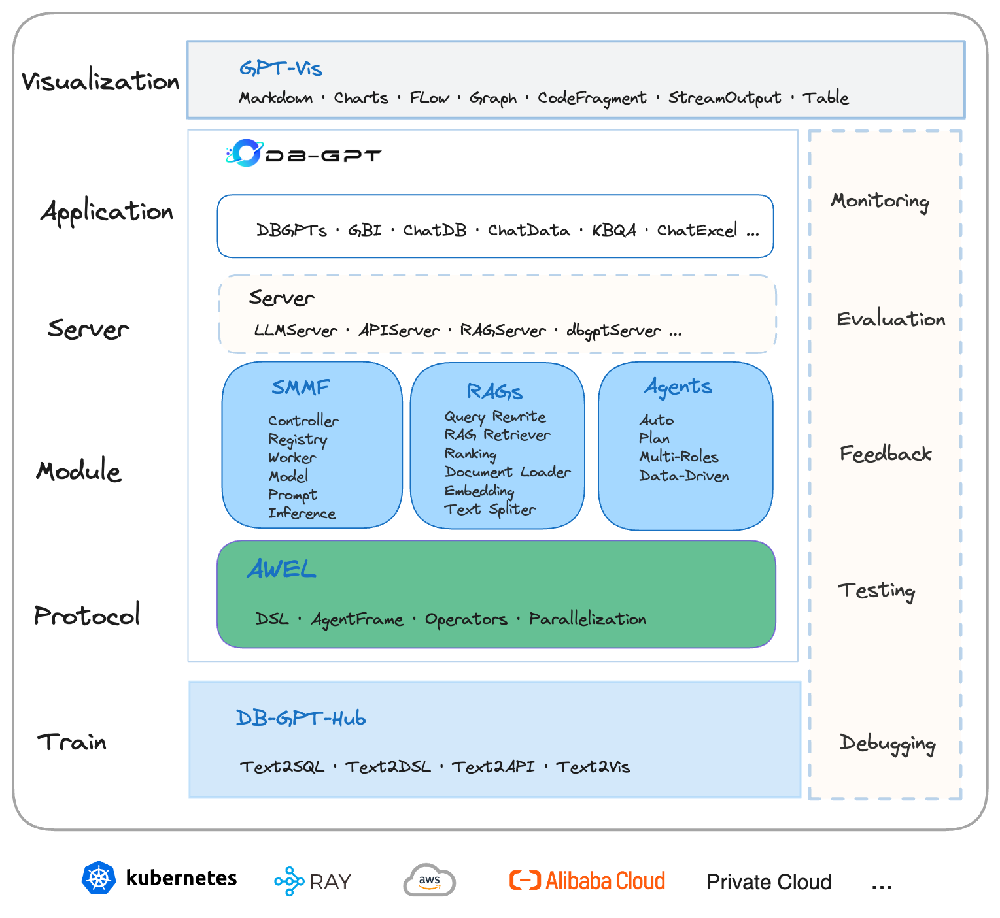

 DB-GPT: AI Native Data App Development framework with AWEL and Agents

<p align="left">
  
</p>

<div align="center">
  <p>
    <a href="https://github.com/eosphoros-ai/DB-GPT">
        
    </a>
    <a href="https://github.com/eosphoros-ai/DB-GPT">
        
    </a>
    <a href="http://dbgpt.cn/">
        
    </a>
    <a href="https://opensource.org/licenses/MIT">
      
    </a>
     <a href="https://github.com/eosphoros-ai/DB-GPT/releases">
      
    </a>
    <a href="https://github.com/eosphoros-ai/DB-GPT/issues">
      
    </a>
    <a href="https://x.com/DBGPT_AI">
      
    </a>
    <a href="https://medium.com/@dbgpt0506">
      
    </a>
    <a href="https://space.bilibili.com/3537113070963392">
      
    </a>
    <a href="https://join.slack.com/t/slack-inu2564/shared_invite/zt-29rcnyw2b-N~ubOD9kFc7b7MDOAM1otA">
      
    </a>
    <a href="https://codespaces.new/eosphoros-ai/DB-GPT">
      
    </a>
  </p>


[](README.md)
[](README.zh.md)
[](README.ja.md) 

[**दस्तावेज़**](http://docs.dbgpt.cn/docs/overview/) | [**हमसे संपर्क करें**](https://github.com/eosphoros-ai/DB-GPT/blob/main/README.zh.md#%E8%81%94%E7%B3%BB%E6%88%91%E4%BB%AC) | [**समुदाय**](https://github.com/eosphoros-ai/community) | [**पेपर**](https://arxiv.org/pdf/2312.17449.pdf)

</div>

## DB-GPT क्या है?

🤖 **DB-GPT AWEL (Agentic Workflow Expression Language) और एजेंटों के साथ एक ओपन सोर्स AI नेटिव डेटा ऐप डेवलपमेंट फ्रेमवर्क है**। 

उद्देश्य बड़े मॉडलों के क्षेत्र में बुनियादी ढांचा बनाना है, मल्टी-मॉडल प्रबंधन (SMMF), Text2SQL प्रभाव अनुकूलन, RAG फ्रेमवर्क और अनुकूलन, मल्टी-एजेंट फ्रेमवर्क सहयोग, AWEL (एजेंट वर्कफ्लो ऑर्केस्ट्रेशन) आदि जैसे कई तकनीकी क्षमताओं के विकास के माध्यम से। जो बड़े मॉडल अनुप्रयोगों को डेटा के साथ सरल और अधिक सुविधाजनक बनाता है।

🚀 **डेटा 3.0 युग में, मॉडलों और डेटाबेस पर आधारित, उद्यम और डेवलपर्स कम कोड के साथ अपने खुद के विशेष अनुप्रयोग बना सकते हैं।**

### परिचय 
DB-GPT की वास्तुकला निम्नलिखित चित्र में दिखाई गई है:

<p align="center">
  
</p>

कोर क्षमताओं में निम्नलिखित भाग शामिल हैं:

- **RAG (Retrieval Augmented Generation)**: RAG वर्तमान में सबसे व्यावहारिक रूप से कार्यान्वित और अत्यंत आवश्यक डोमेन है। DB-GPT ने पहले ही RAG पर आधारित एक फ्रेमवर्क लागू किया है, जो उपयोगकर्ताओं को DB-GPT की RAG क्षमताओं का उपयोग करके ज्ञान-आधारित अनुप्रयोग बनाने की अनुमति देता है।

- **GBI (Generative Business Intelligence)**: जनरेटिव BI DB-GPT परियोजना की कोर क्षमताओं में से एक है, जो उद्यम रिपोर्ट विश्लेषण और व्यावसायिक अंतर्दृष्टि बनाने के लिए आधारभूत डेटा बुद्धिमत्ता तकनीक प्रदान करता है।

- **फाइन-ट्यूनिंग फ्रेमवर्क**: मॉडल फाइन-ट्यूनिंग किसी भी उद्यम के लिए लंबवत और विशिष्ट डोमेन में कार्यान्वित करने के लिए एक अनिवार्य क्षमता है। DB-GPT एक पूर्ण फाइन-ट्यूनिंग फ्रेमवर्क प्रदान करता है जो DB-GPT परियोजना के साथ सहज रूप से एकीकृत होता है। हालिया फाइन-ट्यूनिंग प्रयासों में, स्पाइडर डेटासेट पर आधारित एक सटीकता दर 82.5% हासिल की गई है।

- **डेटा-ड्रिवन मल्टी-एजेंट फ्रेमवर्क**: DB-GPT एक डेटा-ड्रिवन स्व-विकासशील मल्टी-एजेंट फ्रेमवर्क प्रदान करता है, जिसका उद्देश्य निरंतर डेटा पर आधारित निर्णय लेना और निष्पादित करना है।

- **डेटा फैक्टरी**: डेटा फैक्टरी मुख्य रूप से बड़े मॉडलों के युग में विश्वसनीय ज्ञान और डेटा को साफ करने और संसाधित करने के बारे में है।

- **डेटा स्रोत**: विभिन्न डेटा स्रोतों को एकीकृत करना ताकि उत्पादन व्यावसायिक डेटा को DB-GPT की कोर क्षमताओं से सहज रूप से जोड़ा जा सके।

#### सबमॉड्यूल
- [DB-GPT-Hub](https://github.com/eosphoros-ai/DB-GPT-Hub) बड़े भाषा मॉडलों (LLMs) पर पर्यवेक्षित फाइन-ट्यूनिंग (SFT) लागू करके उच्च प्रदर्शन के साथ Text-to-SQL वर्कफ्लो।

- [dbgpts](https://github.com/eosphoros-ai/dbgpts)  dbgpts आधिकारिक रिपॉजिटरी है जिसमें कुछ डेटा ऐप्स, AWEL ऑपरेटर्स, AWEL वर्कफ्लो टेम्प्लेट और एजेंट शामिल हैं जो DB-GPT पर बनाए गए हैं।

#### डीपविकी
- [DB-GPT](https://deepwiki.com/eosphoros-ai/DB-GPT)
- [DB-GPT-HUB](https://deepwiki.com/eosphoros-ai/DB-GPT-Hub)
- [dbgpts](https://deepwiki.com/eosphoros-ai/dbgpts)


#### Text2SQL फाइनट्यून

  |     LLM     |  समर्थित  | 
  |:-----------:|:-----------:|
  |    LLaMA    |      ✅     |
  |   LLaMA-2   |      ✅     | 
  |    BLOOM    |      ✅     | 
  |   BLOOMZ    |      ✅     | 
  |   Falcon    |      ✅     | 
  |  Baichuan   |      ✅     | 
  |  Baichuan2  |      ✅     | 
  |  InternLM   |      ✅     |
  |    Qwen     |      ✅     | 
  |   XVERSE    |      ✅     | 
  |  ChatGLM2   |      ✅     |                                                                                                                                                                                                                                                                                                                                                                                                                                                                                                                                                        


[Text2SQL फाइनट्यून के बारे में अधिक जानकारी](https://github.com/eosphoros-ai/DB-GPT-Hub)

- [DB-GPT-Plugins](https://github.com/eosphoros-ai/DB-GPT-Plugins) DB-GPT प्लगइन्स जो Auto-GPT प्लगइन को सीधे चला सकते हैं
- [GPT-Vis](https://github.com/eosphoros-ai/GPT-Vis) विज़ुअलाइज़ेशन प्रोटोकॉल

### AI-नेटिव डेटा ऐप 
---
- 🔥🔥🔥 [रिलीज़ V0.7.0 | महत्वपूर्ण अपग्रेड का एक सेट](http://docs.dbgpt.cn/blog/db-gpt-v070-release)
  - [MCP प्रोटोकॉल का समर्थन](https://github.com/eosphoros-ai/DB-GPT/pull/2497)
  - [DeepSeek R1 का समर्थन](https://github.com/deepseek-ai/DeepSeek-R1)
  - [QwQ-32B का समर्थन](https://huggingface.co/Qwen/QwQ-32B)
  - [बुनियादी मॉड्यूल को रिफैक्टर करें]()
    - [dbgpt-app](./packages/dbgpt-app)
    - [dbgpt-core](./packages/dbgpt-core)
    - [dbgpt-serve](./packages/dbgpt-serve)
    - [dbgpt-client](./packages/dbgpt-client)
    - [dbgpt-accelerator](./packages/dbgpt-accelerator)
    - [dbgpt-ext](./packages/dbgpt-ext)
---


## इंस्टॉलेशन / क्विक स्टार्ट 


[**उपयोग ट्यूटोरियल**](http://docs.dbgpt.cn/docs/overview)
- [**इंस्टॉल**](http://docs.dbgpt.cn/docs/installation)
  - [Docker](http://docs.dbgpt.cn/docs/installation/docker)
  - [सोर्स कोड](http://docs.dbgpt.cn/docs/installation/sourcecode)
- [**क्विकस्टार्ट**](http://docs.dbgpt.cn/docs/quickstart)
- [**अनुप्रयोग**](http://docs.dbgpt.cn/docs/operation_manual)
  - [डेवलपमेंट गाइड](http://docs.dbgpt.cn/docs/cookbook/app/data_analysis_app_develop) 
  - [ऐप उपयोग](http://docs.dbgpt.cn/docs/application/app_usage)
  - [AWEL फ्लो उपयोग](http://docs.dbgpt.cn/docs/application/awel_flow_usage)
- [**डिबगिंग**](http://docs.dbgpt.cn/docs/operation_manual/advanced_tutorial/debugging)
- [**उन्नत उपयोग**](http://docs.dbgpt.cn/docs/application/advanced_tutorial/cli)
  - [SMMF](http://docs.dbgpt.cn/docs/application/advanced_tutorial/smmf)
  - [फाइनट्यून](http://docs.dbgpt.cn/docs/application/fine_tuning_manual/dbgpt_hub)
  - [AWEL](http://docs.dbgpt.cn/docs/awel/tutorial)


## विशेषताएं

वर्तमान में, हमने अपनी वर्तमान क्षमताओं को प्रदर्शित करने के लिए कई प्रमुख विशेषताओं का परिचय दिया है:
- **प्राइवेट डोमेन Q&A & डेटा प्रोसेसिंग**

  DB-GPT परियोजना ज्ञान आधार निर्माण में सुधार करने और संरचित और असंरचित डेटा दोनों के कुशल भंडारण और पुनर्प्राप्ति को सक्षम करने के लिए डिज़ाइन की गई कार्यक्षमताओं की एक श्रृंखला प्रदान करती है। इन कार्यक्षमताओं में कई फ़ाइल स्वरूपों को अपलोड करने के लिए अंतर्निहित समर्थन, कस्टम डेटा एक्सट्रैक्शन प्लग-इन्स को एकीकृत करने की क्षमता, और बड़ी मात्रा में जानकारी को प्रभावी ढंग से प्रबंधित करने के लिए एकीकृत वेक्टर भंडारण और पुनर्प्राप्ति क्षमताएं शामिल हैं।

- **मल्टी-डेटा स्रोत & GBI (जनरेटिव बिजनेस इंटेलिजेंस)**

  DB-GPT परियोजना Excel, डेटाबेस और डेटा गोदाम सहित विविध डेटा स्रोतों के साथ सहज प्राकृतिक भाषा इंटरैक्शन को सुविधाजनक बनाती है। यह इन स्रोतों से जानकारी को क्वेरी और पुनर्प्राप्त करने की प्रक्रिया को सरल बनाता है, उपयोगकर्ताओं को सहज बातचीत में संलग्न होने और अंतर्दृष्टि प्राप्त करने में सक्षम बनाता है। इसके अलावा, DB-GPT विश्लेषणात्मक रिपोर्ट उत्पन्न करने का समर्थन करता है, उपयोगकर्ताओं को मूल्यवान डेटा सारांश और व्याख्याएं प्रदान करता है।

- **मल्टी-एजेंट और प्लगइन्स**

  यह विभिन्न कार्यों को करने के लिए कस्टम प्लग-इन्स का समर्थन प्रदान करता है और मूल रूप से Auto-GPT प्लग-इन मॉडल को एकीकृत करता है। एजेंट प्रोटोकॉल एजेंट प्रोटोकॉल मानक का पालन करता है।

- **स्वचालित फाइन-ट्यूनिंग text2SQL**

  हमने बड़े भाषा मॉडलों (LLMs), Text2SQL डेटासेट, LoRA/QLoRA/Pturning और अन्य फाइन-ट्यूनिंग विधियों पर केंद्रित एक स्वचालित फाइन-ट्यूनिंग हल्का फ्रेमवर्क विकसित किया है। यह फ्रेमवर्क Text-to-SQL फाइन-ट्यूनिंग को सरल बनाता है, इसे एक असेंबली लाइन प्रक्रिया जितना सरल बनाता है। [DB-GPT-Hub](https://github.com/eosphoros-ai/DB-GPT-Hub)

  - **SMMF (सर्विस-ओरिएंटेड मल्टी-मॉडल मैनेजमेंट फ्रेमवर्क)**

    हम व्यापक मॉडल समर्थन प्रदान करते हैं, जिसमें ओपन-सोर्स और API एजेंट दोनों से दर्जनों बड़े भाषा मॉडल (LLMs) शामिल हैं, जैसे LLaMA/LLaMA2, Baichuan, ChatGLM, Wenxin, Tongyi, Zhipu, और कई अन्य। 

  - समाचार
    <table>
      <thead>
        <tr>
          <th>प्रदाता</th>
          <th>समर्थित</th>
          <th>मॉडल</th>
        </tr>
      </thead>
      <tbody>
        <tr>
          <td align="center" valign="middle">DeepSeek</td>
          <td align="center" valign="middle">✅</td>
          <td>
            🔥🔥🔥  <a href="https://huggingface.co/deepseek-ai/DeepSeek-R1-0528">DeepSeek-R1-0528</a><br/>
            🔥🔥🔥  <a href="https://huggingface.co/deepseek-ai/DeepSeek-V3-0324">DeepSeek-V3-0324</a><br/>
            🔥🔥🔥  <a href="https://huggingface.co/deepseek-ai/DeepSeek-R1">DeepSeek-R1</a><br/>
            🔥🔥🔥  <a href="https://huggingface.co/deepseek-ai/DeepSeek-V3">DeepSeek-V3</a><br/>
            🔥🔥🔥  <a href="https://huggingface.co/deepseek-ai/DeepSeek-R1-Distill-Llama-70B">DeepSeek-R1-Distill-Llama-70B</a><br/>
            🔥🔥🔥  <a href="https://huggingface.co/deepseek-ai/DeepSeek-R1-Distill-Qwen-32B">DeepSeek-R1-Distill-Qwen-32B</a><br/>
            🔥🔥🔥  <a href="https://huggingface.co/deepseek-ai/DeepSeek-Coder-V2-Instruct">DeepSeek-Coder-V2-Instruct</a><br/>
          </td>
        </tr>
        <tr>
          <td align="center" valign="middle">Qwen</td>
          <td align="center" valign="middle">✅</td>
          <td>
            🔥🔥🔥  <a href="https://huggingface.co/Qwen/Qwen3-235B-A22B">Qwen3-235B-A22B</a><br/>
            🔥🔥🔥  <a href="https://huggingface.co/Qwen/Qwen3-30B-A3B">Qwen3-30B-A3B</a><br/>
            🔥🔥🔥  <a href="https://huggingface.co/Qwen/Qwen3-32B">Qwen3-32B</a><br/>
            🔥🔥🔥  <a href="https://huggingface.co/Qwen/QwQ-32B">QwQ-32B</a><br/>
            🔥🔥🔥  <a href="https://huggingface.co/Qwen/Qwen2.5-Coder-32B-Instruct">Qwen2.5-Coder-32B-Instruct</a><br/>
            🔥🔥🔥  <a href="https://huggingface.co/Qwen/Qwen2.5-Coder-14B-Instruct">Qwen2.5-Coder-14B-Instruct</a><br/>
            🔥🔥🔥  <a href="https://huggingface.co/Qwen/Qwen2.5-72B-Instruct">Qwen2.5-72B-Instruct</a><br/>
            🔥🔥🔥  <a href="https://huggingface.co/Qwen/Qwen2.5-32B-Instruct">Qwen2.5-32B-Instruct</a><br/>
          </td>
        </tr>
        <tr>
          <td align="center" valign="middle">GLM</td>
          <td align="center" valign="middle">✅</td>
          <td>
            🔥🔥🔥  <a href="https://huggingface.co/THUDM/GLM-Z1-32B-0414">GLM-Z1-32B-0414</a><br/>
            🔥🔥🔥  <a href="https://huggingface.co/THUDM/GLM-4-32B-0414">GLM-4-32B-0414</a><br/>
            🔥🔥🔥  <a href="https://huggingface.co/THUDM/glm-4-9b-chat">Glm-4-9b-chat</a>
          </td>
        </tr>
        <tr>
          <td align="center" valign="middle">Llama</td>
          <td align="center" valign="middle">✅</td>
          <td>
            🔥🔥🔥  <a href="https://huggingface.co/meta-llama/Meta-Llama-3.1-405B-Instruct">Meta-Llama-3.1-405B-Instruct</a><br/>
            🔥🔥🔥  <a href="https://huggingface.co/meta-llama/Meta-Llama-3.1-70B-Instruct">Meta-Llama-3.1-70B-Instruct</a><br/>
            🔥🔥🔥  <a href="https://huggingface.co/meta-llama/Meta-Llama-3.1-8B-Instruct">Meta-Llama-3.1-8B-Instruct</a><br/>
            🔥🔥🔥  <a href="https://huggingface.co/meta-llama/Meta-Llama-3-70B-Instruct">Meta-Llama-3-70B-Instruct</a><br/>
            🔥🔥🔥  <a href="https://huggingface.co/meta-llama/Meta-Llama-3-8B-Instruct">Meta-Llama-3-8B-Instruct</a>
          </td>
        </tr>
        <tr>
          <td align="center" valign="middle">Gemma</td>
          <td align="center" valign="middle">✅</td>
          <td>
            🔥🔥🔥  <a href="https://huggingface.co/google/gemma-2-27b-it">gemma-2-27b-it</a><br>
            🔥🔥🔥  <a href="https://huggingface.co/google/gemma-2-9b-it">gemma-2-9b-it</a><br>
            🔥🔥🔥  <a href="https://huggingface.co/google/gemma-7b-it">gemma-7b-it</a><br>
            🔥🔥🔥  <a href="https://huggingface.co/google/gemma-2b-it">gemma-2b-it</a>
          </td>
        </tr>
        <tr>
          <td align="center" valign="middle">Yi</td>
          <td align="center" valign="middle">✅</td>
          <td>
            🔥🔥🔥  <a href="https://huggingface.co/01-ai/Yi-1.5-34B-Chat">Yi-1.5-34B-Chat</a><br/>
            🔥🔥🔥  <a href="https://huggingface.co/01-ai/Yi-1.5-9B-Chat">Yi-1.5-9B-Chat</a><br/>
            🔥🔥🔥  <a href="https://huggingface.co/01-ai/Yi-1.5-6B-Chat">Yi-1.5-6B-Chat</a><br/>
            🔥🔥🔥  <a href="https://huggingface.co/01-ai/Yi-34B-Chat">Yi-34B-Chat</a>
          </td>
        </tr>
        <tr>
          <td align="center" valign="middle">Starling</td>
          <td align="center" valign="middle">✅</td>
          <td>
            🔥🔥🔥  <a href="https://huggingface.co/Nexusflow/Starling-LM-7B-beta">Starling-LM-7B-beta</a>
          </td>
        </tr>
        <tr>
          <td align="center" valign="middle">SOLAR</td>
          <td align="center" valign="middle">✅</td>
          <td>
            🔥🔥🔥  <a href="https://huggingface.co/upstage/SOLAR-10.7B-Instruct-v1.0">SOLAR-10.7B</a>
          </td>
        </tr>
        <tr>
          <td align="center" valign="middle">Mixtral</td>
          <td align="center" valign="middle">✅</td>
          <td>
            🔥🔥🔥  <a href="https://huggingface.co/mistralai/Mixtral-8x7B-Instruct-v0.1">Mixtral-8x7B</a>
          </td>
        </tr>
        <tr>
          <td align="center" valign="middle">Phi</td>
          <td align="center" valign="middle">✅</td>
          <td>
            🔥🔥🔥  <a href="https://huggingface.co/collections/microsoft/phi-3-6626e15e9585a200d2d761e3">Phi-3</a>
          </td>
        </tr>
      </tbody>
    </table>

- [अधिक समर्थित LLMs](http://docs.dbgpt.site/docs/modules/smmf)

- **गोपनीयता और सुरक्षा**
  
  हम विभिन्न तकनीकों के कार्यान्वयन के माध्यम से डेटा की गोपनीयता और सुरक्षा सुनिश्चित करते हैं, जिसमें निजीकरण बड़े मॉडल और प्रॉक्सी डेसेंसिटाइज़ेशन शामिल हैं।

- समर्थित डेटा स्रोत
  - [डेटा स्रोत](http://docs.dbgpt.cn/docs/modules/connections)

## छवि
🌐 [AutoDL छवि](https://www.codewithgpu.com/i/eosphoros-ai/DB-GPT/dbgpt)


## योगदान

- नए योगदान के लिए विस्तृत दिशानिर्देशों की जांच करने के लिए, कृपया [कैसे योगदान करें](https://github.com/eosphoros-ai/DB-GPT/blob/main/CONTRIBUTING.md) देखें

### योगदानकर्ता दीवार
<a href="https://github.com/eosphoros-ai/DB-GPT/graphs/contributors">
  
</a>


## लाइसेंस
MIT लाइसेंस (MIT)

## डिस्क्लेमर
- [डिस्क्लेमर](./DISCKAIMER.md)

## उद्धरण
यदि आप DB-GPT की समग्र वास्तुकला को समझना चाहते हैं, तो कृपया <a href="https://arxiv.org/abs/2312.17449" target="_blank">पेपर</a> और <a href="https://arxiv.org/abs/2404.10209" target="_blank">पेपर</a> का उद्धरण करें

यदि आप एजेंट विकास के लिए DB-GPT का उपयोग सीखना चाहते हैं, तो कृपया <a href="https://arxiv.org/abs/2412.13520" target="_blank">पेपर</a> का उद्धरण करें
```bibtex
@article{xue2023dbgpt,
      title={DB-GPT: Empowering Database Interactions with Private Large Language Models}, 
      author={Siqiao Xue and Caigao Jiang and Wenhui Shi and Fangyin Cheng and Keting Chen and Hongjun Yang and Zhiping Zhang and Jianshan He and Hongyang Zhang and Ganglin Wei and Wang Zhao and Fan Zhou and Danrui Qi and Hong Yi and Shaodong Liu and Faqiang Chen},
      year={2023},
      journal={arXiv preprint arXiv:2312.17449},
      url={https://arxiv.org/abs/2312.17449}
}
@misc{huang2024romasrolebasedmultiagentdatabase,
      title={ROMAS: A Role-Based Multi-Agent System for Database monitoring and Planning}, 
      author={Yi Huang and Fangyin Cheng and Fan Zhou and Jiahui Li and Jian Gong and Hongjun Yang and Zhidong Fan and Caigao Jiang and Siqiao Xue and Faqiang Chen},
      year={2024},
      eprint={2412.13520},
      archivePrefix={arXiv},
      primaryClass={cs.AI},
      url={https://arxiv.org/abs/2412.13520}, 
}
@inproceedings{xue2024demonstration,
      title={Demonstration of DB-GPT: Next Generation Data Interaction System Empowered by Large Language Models}, 
      author={Siqiao Xue and Danrui Qi and Caigao Jiang and Wenhui Shi and Fangyin Cheng and Keting Chen and Hongjun Yang and Zhiping Zhang and Jianshan He and Hongyang Zhang and Ganglin Wei and Wang Zhao and Fan Zhou and Hong Yi and Shaodong Liu and Hongjun Yang and Faqiang Chen},
      year={2024},
      booktitle = "Proceedings of the VLDB Endowment",
      url={https://arxiv.org/abs/2404.10209}
}
```


## संपर्क जानकारी
DB-GPT में योगदान करने वाले सभी लोगों को धन्यवाद! आपकी विचार, कोड, टिप्पणियां, और यहां तक कि घटनाओं और सोशल प्लेटफार्मों पर उन्हें साझा करना DB-GPT को बेहतर बना सकता है।
हम एक समुदाय बनाने पर काम कर रहे हैं, यदि आपके पास समुदाय बनाने के लिए कोई विचार हैं, तो कृपया हमसे संपर्क करें।  

- [GitHub मुद्दे](https://github.com/eosphoros-ai/DB-GPT/issues) ⭐️: GB-DPT का उपयोग करने के बारे में प्रश्नों के लिए, CONTRIBUTING देखें।  
- [GitHub चर्चाएं](https://github.com/orgs/eosphoros-ai/discussions) ⭐️: अपना अनुभव या अद्वितीय ऐप्स साझा करें।  
- [ट्विटर](https://x.com/DBGPT_AI) ⭐️: कृपया हमसे बात करने के लिए स्वतंत्र महसूस करें।  


[](https://star-history.com/#csunny/DB-GPT)