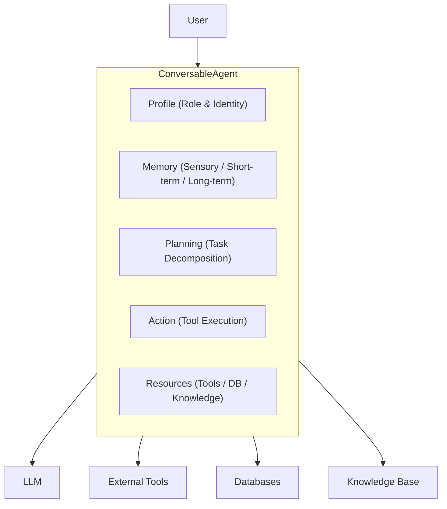

# Agent Framework

DB-GPT provides a **data-driven multi-agent framework** for building autonomous AI agents that can collaborate, use tools, access databases, and maintain memory across conversations.

## Agent architecture



Every agent in DB-GPT is built around five core modules:

| Module | Purpose |
|---|---|
| **Profile** | Defines the agent's role, name, goal, and constraints |
| **Memory** | Stores conversation history and learned information |
| **Planning** | Decomposes complex tasks into executable steps |
| **Action** | Executes tools, queries, and other operations |
| **Resource** | Provides access to tools, databases, knowledge bases |

## Key concepts

### ConversableAgent

The base class for all agents. It implements the conversation loop: receive message, think (plan), act, respond.

### Multi-agent collaboration

Multiple agents can work together on complex tasks:

- **Sequential** — Agents pass results to each other in order
- **Parallel** — Multiple agents work on sub-tasks simultaneously
- **Manager-Worker** — A planning agent delegates to specialist agents

### Memory types

| Memory Type | Scope | Persistence |
|---|---|---|
| **Sensory** | Current message | None |
| **Short-term** | Current conversation | Session |
| **Long-term** | Across conversations | Database |
| **Hybrid** | Combines all three | Mixed |

### Built-in agent types

DB-GPT includes several pre-built agents:

- **Data Analysis Agent** — Analyzes data, generates SQL, creates charts
- **Summary Agent** — Summarizes long documents and conversations
- **Code Agent** — Generates and executes code
- **Chat Agent** — General-purpose conversational agent

## Quick example

```python
from dbgpt.agent import ConversableAgent, AgentContext

# Define a simple custom agent
agent = ConversableAgent(
    name="DataAnalyst",
    role="You are a data analysis expert",
    goal="Help users analyze data and generate insights",
    llm_config={"model": "chatgpt_proxyllm"},
)

# Start a conversation
result = await agent.a_send("Analyze the sales trends for Q4 2024")
```

## What's next

- [Agent Introduction](/docs/agents/introduction/) — Detailed agent framework guide
- [Custom Agents](/docs/agents/introduction/custom_agents) — Build your own agents
- [Agent Tools](/docs/agents/introduction/tools) — Connect agents to tools
- [Agent Planning](/docs/agents/introduction/planning) — Task decomposition strategies
