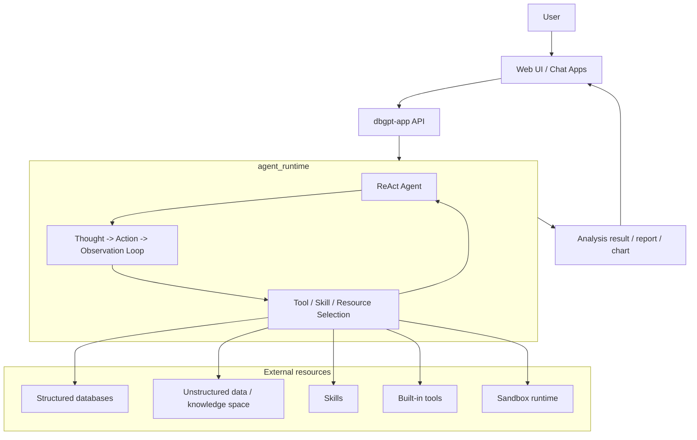

# Architecture

DB-GPT is organized as a Python monorepo with a ReAct-centered agent runtime.
The Web UI sends requests to the application layer, the ReAct Agent executes in an
agent runtime loop, and the agent uses tools, skills, databases, and knowledge
resources to produce analysis results back to the UI.

## Repository layout

```text
DB-GPT/
├── packages/
│   ├── dbgpt-core/        # Core agent, memory, planning, RAG, model abstractions
│   ├── dbgpt-app/         # Application server, API routes, scenes, UI asset hosting
│   ├── dbgpt-serve/       # Service layer: knowledge, flow, agent resources, app services
│   ├── dbgpt-ext/         # Extensions: datasources, storage backends, RAG connectors
│   ├── dbgpt-client/      # Python client SDK
│   ├── dbgpt-sandbox/     # Sandbox execution runtime for safe code/tool execution
│   └── dbgpt-accelerator/ # Acceleration packages
├── web/                   # Next.js Web UI
├── skills/                # Built-in skills and reusable workflows
├── configs/               # TOML configuration files
└── docs/                  # Docusaurus documentation
```

## Package roles

| Package | Role |
|---|---|
| `dbgpt-core` | Core agent framework, ReAct parser/action flow, memory, planning, RAG, model interfaces |
| `dbgpt-app` | FastAPI application server, chat APIs, runtime orchestration, static UI hosting |
| `dbgpt-serve` | Resource services for knowledge, datasource, flow, app, and agent support |
| `dbgpt-ext` | External connectors such as database/storage/RAG integrations |
| `dbgpt-client` | Client SDK for DB-GPT APIs |
| `dbgpt-sandbox` | Isolated execution runtimes for code and tool execution |
| `skills/` | Packaged domain workflows, scripts, templates, and references |

## High-level architecture



## How it works

1. The user interacts with the Web UI or another client.
2. `dbgpt-app` receives the request and routes it to the agent chat API.
3. The request enters the `agent_runtime` execution loop.
4. The ReAct Agent reasons step by step and chooses the next action.
5. The agent loads and uses external resources as needed:
   - structured databases for SQL analysis
   - unstructured knowledge spaces for retrieval
   - skills for reusable workflows
   - built-in tools for task execution
   - sandbox runtimes for safe code execution
6. The agent combines observations and produces the final analysis output.
7. The result is streamed back to the UI for display.

## Agent runtime model

The runtime is the conceptual execution layer that drives the ReAct loop.
In the codebase, this is implemented through the agent builder, resource manager,
ReAct parser/action flow, and the API streaming handlers that connect to the UI.

Key implementation anchors:

- `packages/dbgpt-core/src/dbgpt/agent/expand/react_agent.py`
- `packages/dbgpt-core/src/dbgpt/agent/util/react_parser.py`
- `packages/dbgpt-app/src/dbgpt_app/openapi/api_v1/agentic_data_api.py`
- `web/hooks/use-react-agent-chat.ts`
- `packages/dbgpt-sandbox/src/dbgpt_sandbox/sandbox/execution_layer/runtime_factory.py`

## Resources used by the agent

### Structured data

Databases and queryable tabular sources are used for SQL-style analysis, schema
linking, and report generation.

### Unstructured data

Knowledge spaces and document collections provide retrieval support for
unstructured content.

### Skills

Built-in skills package repeatable workflows into reusable task units. The agent
can load and execute them during a session.

### Built-in tools

Tools include SQL execution, shell/code execution, HTML rendering, search, and
other task-specific operations registered through the resource manager.

## Result delivery

The output path is designed to be user-facing:

`ReAct Agent` → `agent_runtime` → `streamed result` → `Web UI`

This makes the architecture suitable for interactive data analysis, report
generation, and tool-assisted reasoning.
