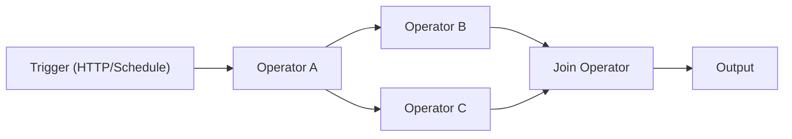

# AWEL (Agentic Workflow Expression Language)

AWEL is a domain-specific language designed specifically for building LLM application workflows. It lets you compose complex AI pipelines as **directed acyclic graphs (DAGs)** using a set of built-in operators.

## Why AWEL?

Traditional LLM application development involves scattered API calls, fragile glue code, and hard-to-maintain pipelines. AWEL solves this by providing:

- **Declarative DAGs** — Define what your pipeline does, not how to wire it
- **Reusable operators** — Compose from built-in and custom operators
- **Stream-native** — First-class streaming support for real-time responses
- **Visual editor** — AWEL Flow in the Web UI for no-code workflow building

## How it works



An AWEL pipeline consists of:

1. **Trigger** — Entry point (HTTP request, schedule, or manual invocation)
2. **Operators** — Processing nodes that transform data
3. **DAG** — The graph connecting triggers and operators

## Core operators

| Operator | Description | Use case |
|---|---|---|
| **MapOperator** | Transform each input item | Data formatting, API calls |
| **ReduceOperator** | Aggregate multiple inputs into one | Summarization, collection |
| **JoinOperator** | Merge results from parallel branches | Multi-source aggregation |
| **BranchOperator** | Route input to different paths | Conditional logic |
| **StreamifyOperator** | Convert batch to stream | Real-time processing |
| **UnstreamifyOperator** | Convert stream to batch | Collecting stream results |
| **TransformStreamOperator** | Transform items in a stream | Stream filtering/mapping |
| **InputOperator** | Provide initial input to a DAG | Pipeline entry data |

## Quick example

A minimal AWEL workflow that takes a user question and generates an LLM response:

```python
from dbgpt.core.awel import DAG, MapOperator, InputOperator

with DAG("simple_chat") as dag:
    input_node = InputOperator(input_source="user_question")
    llm_node = MapOperator(map_function=call_llm)
    input_node >> llm_node
```

## AWEL Flow (visual editor)

The Web UI includes a drag-and-drop AWEL Flow editor where you can:

- Build workflows visually by connecting operator nodes
- Configure each operator's parameters in a sidebar
- Test and debug flows in real-time
- Save and share flow templates

Access it from the Web UI sidebar under **AWEL Flow**.

## What's next

- [AWEL Tutorial](/docs/awel/tutorial) — Step-by-step learning path
- [AWEL Cookbook](/docs/awel/cookbook) — Practical recipes for common patterns
- [AWEL Flow Usage](/docs/application/awel) — Using the visual editor
