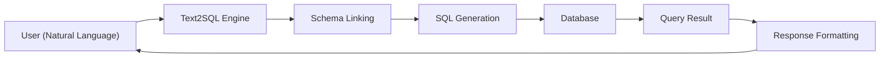

# Data Sources

DB-GPT connects to a wide range of data sources, enabling natural language interaction with your databases, spreadsheets, and data warehouses.

## Supported data sources

| Data Source | Type | Status |
|---|---|---|
| **SQLite** | Relational | Built-in (default) |
| **MySQL** | Relational | Supported |
| **PostgreSQL** | Relational | Supported |
| **ClickHouse** | OLAP | Supported |
| **DuckDB** | Analytical | Supported |
| **MSSQL** | Relational | Supported |
| **Oracle** | Relational | Supported |
| **Excel** | Spreadsheet | Supported |
| **CSV** | Flat file | Supported |

## How it works

1. **User** asks a question in natural language
2. **Text2SQL** engine analyzes the question and linked database schema
3. **SQL** is generated based on the question context
4. **Database** executes the query
5. **Result** is formatted and returned (optionally with charts)

## Adding a data source

### Via Web UI

1. Open the DB-GPT Web UI
2. Go to **Data Sources** in the sidebar
3. Click **Add Data Source**
4. Select the database type and fill in connection details
5. Test the connection and save

### Via configuration

Data source connections can also be configured in the TOML config file or managed through the REST API.

## Text2SQL

DB-GPT excels at converting natural language to SQL queries:

- **Schema linking** — Automatically maps natural language terms to table/column names
- **Multi-turn conversation** — Refine queries through follow-up questions
- **Chart generation** — Visualize query results as charts and dashboards
- **Fine-tuning** — Optimize Text2SQL accuracy for your specific domain

:::tip
For best Text2SQL results, ensure your database tables and columns have descriptive names and comments.
:::

## What's next

- [Chat DB](/docs/application/apps/chat_db) — Chat with your database
- [Chat Excel](/docs/application/apps/chat_excel) — Chat with Excel files
- [Chat Dashboard](/docs/application/apps/chat_dashboard) — Build data dashboards
- [Datasource Integrations](/docs/installation/integrations) — Install additional connectors
- [Connections Module](/docs/modules/connections) — Deep dive into data source management
