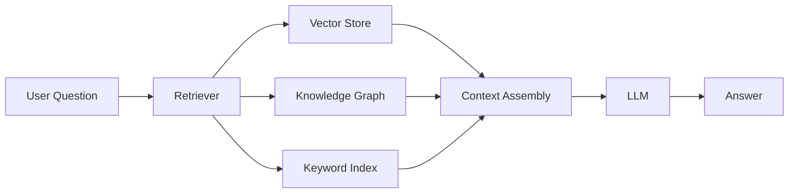
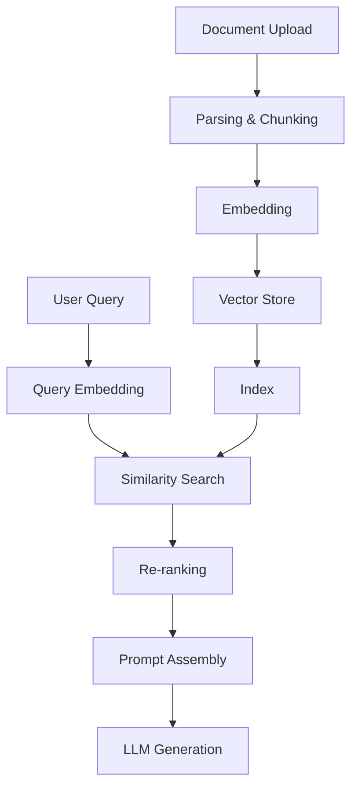

# RAG (Retrieval-Augmented Generation)

RAG enhances LLM responses by retrieving relevant context from your own data before generating an answer. DB-GPT provides a comprehensive RAG framework supporting multiple retrieval strategies.

## How RAG works

1. **User asks a question**
2. **Retriever** searches your knowledge base for relevant documents
3. **Context** is assembled from retrieved chunks
4. **LLM** generates an answer grounded in the retrieved context

## Knowledge base types

DB-GPT supports multiple knowledge base types out of the box:

| Type | Storage | Best for |
|---|---|---|
| **Vector** | ChromaDB, Milvus, OceanBase | Semantic similarity search |
| **Knowledge Graph** | TuGraph, Neo4j | Entity relationships, structured Q&A |
| **Keyword (BM25)** | Built-in | Exact keyword matching |
| **Hybrid** | Combines multiple | Best-of-both retrieval |

## Supported file formats

Upload and process a wide variety of document formats:

- **Documents**: PDF, Word (.docx), Markdown, TXT
- **Spreadsheets**: Excel (.xlsx), CSV
- **Web**: HTML, URLs
- **Code**: Python, Java, and other source files

## RAG pipeline

The full RAG pipeline in DB-GPT:

### Key steps

1. **Parsing** — Extract text from uploaded documents
2. **Chunking** — Split text into manageable segments
3. **Embedding** — Convert chunks into vector representations
4. **Storage** — Store vectors in a vector database
5. **Retrieval** — Find relevant chunks for a given query
6. **Re-ranking** — Optionally re-rank results for better relevance
7. **Generation** — Feed context + query to the LLM

## Quick start with RAG

1. Open the DB-GPT Web UI
2. Navigate to **Knowledge Base** in the sidebar
3. Create a new knowledge base
4. Upload your documents
5. Wait for processing to complete
6. Start chatting with your knowledge base

For programmatic access, see the [RAG Cookbook](/docs/cookbook/rag/graph_rag_app_develop).

## What's next

- [Knowledge Base UI](/docs/getting-started/web-ui/knowledge-base) — Manage knowledge bases in the Web UI
- [Graph RAG](/docs/application/graph_rag) — Knowledge graph-based retrieval
- [RAG Module](/docs/modules/rag) — Deep dive into the RAG framework
- [RAG Development Guide](/docs/cookbook/rag/graph_rag_app_develop) — Build RAG apps programmatically
