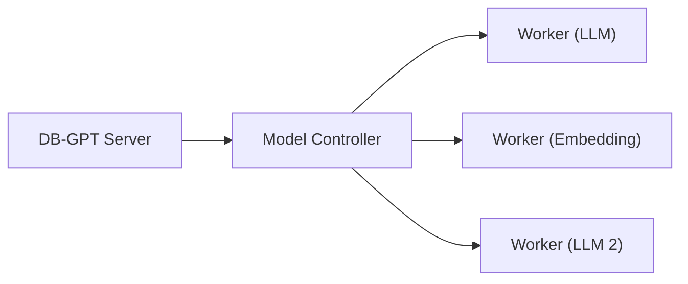

# SMMF (Service-oriented Multi-Model Management Framework)

SMMF is DB-GPT's model management layer. It provides a unified interface for managing, switching, and deploying multiple LLM and embedding models — whether they are API proxies or locally hosted.

## Why SMMF?

Different tasks benefit from different models. SMMF lets you:

- **Run multiple models** simultaneously (e.g., one for chat, one for embeddings)
- **Switch models** without code changes — just update config
- **Scale independently** — deploy models on separate machines in cluster mode
- **Mix providers** — use OpenAI for chat and a local model for embeddings

## Supported providers

### API Proxy

| Provider | Config prefix | Example models |
|---|---|---|
| **OpenAI** | `proxy/openai` | GPT-4o, GPT-4o-mini |
| **DeepSeek** | `proxy/deepseek` | DeepSeek-V3, DeepSeek-R1 |
| **Qwen (Tongyi)** | `proxy/tongyi` | Qwen-Max, Qwen-Plus |
| **SiliconFlow** | `proxy/siliconflow` | Various hosted models |
| **Ollama** | `proxy/ollama` | Any Ollama-served model |
| **Azure OpenAI** | `proxy/openai` | Azure-hosted OpenAI models |

### Local Inference

| Provider | Config prefix | Requirements |
|---|---|---|
| **HuggingFace** | `hf` | GPU recommended |
| **vLLM** | `vllm` | NVIDIA GPU + CUDA |
| **llama.cpp** | `llama.cpp` | CPU or GPU |
| **MLX** | `mlx` | Apple Silicon Mac |

## Configuration

Models are configured in TOML files under `configs/`:

```toml
[models]

# LLM configuration
[[models.llms]]
name = "chatgpt_proxyllm"
provider = "proxy/openai"
api_key = "sk-..."

# Embedding model configuration
[[models.embeddings]]
name = "text-embedding-3-small"
provider = "proxy/openai"
api_key = "sk-..."
```

You can define multiple LLMs and embeddings in the same config file.

## Deployment modes

### Standalone

All models run in the same process as the DB-GPT server. Simple and suitable for development or single-machine deployments.

```bash
uv run dbgpt start webserver --config configs/dbgpt-proxy-openai.toml
```

### Cluster

Models run on separate worker nodes, managed by a controller. Suitable for production deployments with multiple GPUs or machines.



Learn more: [Cluster Deployment](/docs/installation/model_service/cluster)

## What's next

- [Model Providers](/docs/getting-started/providers/) — Detailed setup for each provider
- [SMMF Module](/docs/modules/smmf) — Deep dive into multi-model management
- [Cluster Deployment](/docs/installation/model_service/cluster) — Scale with multiple workers
