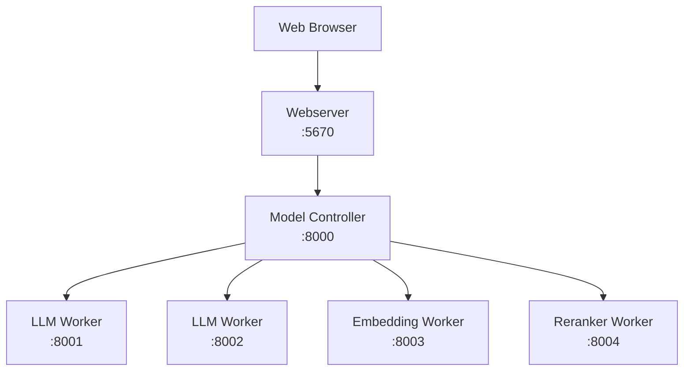

# Cluster Deployment

Deploy DB-GPT as a distributed cluster — separate the webserver, model workers, and controller for scalability.

## Architecture overview



| Component | Role | Default Port |
|---|---|---|
| **Controller** | Service registry and routing | 8000 |
| **LLM Worker** | Serves language models | 8001+ |
| **Embedding Worker** | Serves embedding models | 8003+ |
| **Reranker Worker** | Serves reranking models | 8004+ |
| **API Server** | REST API gateway (optional) | 8100 |
| **Webserver** | Web UI + application logic | 5670 |

## Option A — Manual cluster (CLI)

### Step 1 — Start the controller

```bash
dbgpt start controller
```

The controller starts on port `8000` by default.

### Step 2 — Start LLM workers

```bash
dbgpt start worker \
  --model_name glm-4-9b-chat \
  --model_path /app/models/glm-4-9b-chat \
  --port 8001 \
  --controller_addr http://127.0.0.1:8000
```

Add more workers on different ports:

```bash
dbgpt start worker \
  --model_name vicuna-13b-v1.5 \
  --model_path /app/models/vicuna-13b-v1.5 \
  --port 8002 \
  --controller_addr http://127.0.0.1:8000
```

:::info
Replace model names and paths with your own. Each worker must use a unique port.
:::

### Step 3 — Start embedding worker

```bash
dbgpt start worker \
  --model_name text2vec \
  --model_path /app/models/text2vec-large-chinese \
  --worker_type text2vec \
  --port 8003 \
  --controller_addr http://127.0.0.1:8000
```

### Step 4 — Start reranker worker (optional)

```bash
dbgpt start worker \
  --worker_type text2vec \
  --rerank \
  --model_name bge-reranker-base \
  --model_path /app/models/bge-reranker-base \
  --port 8004 \
  --controller_addr http://127.0.0.1:8000
```

### Step 5 — Verify deployed models

```bash
dbgpt model list
```

Expected output:

```
+-------------------+------------+------+---------+
|    Model Name     | Model Type | Port | Healthy |
+-------------------+------------+------+---------+
|   glm-4-9b-chat   |    llm     | 8001 |   True  |
|  vicuna-13b-v1.5  |    llm     | 8002 |   True  |
|     text2vec      |  text2vec  | 8003 |   True  |
| bge-reranker-base |  text2vec  | 8004 |   True  |
+-------------------+------------+------+---------+
```

### Step 6 — Start the webserver

```bash
LLM_MODEL=glm-4-9b-chat \
MODEL_SERVER=http://127.0.0.1:8000 \
dbgpt start webserver --light --remote_embedding
```

| Flag | Purpose |
|---|---|
| `--light` | Don't start embedded model service |
| `--remote_embedding` | Use remote embedding workers |

---

## Option B — Docker Compose cluster

Use the pre-built cluster Compose file:

```bash
docker compose -f docker/compose_examples/cluster-docker-compose.yml up -d
```

This starts:

- **Controller** — Service registry
- **LLM Worker** — `glm-4-9b-chat` on GPU
- **Embedding Worker** — `text2vec-large-chinese` on GPU
- **Webserver** — Web UI in lightweight mode

:::warning
Edit the Compose file to set your model paths before running. The default expects models at `/data/models/`.
:::

### High-availability cluster

For HA deployments with multiple controllers:

```bash
docker compose -f docker/compose_examples/ha-cluster-docker-compose.yml up -d
```

## CLI reference

<details>
<summary><strong>dbgpt start worker --help</strong></summary>

Key options:

| Option | Description | Default |
|---|---|---|
| `--model_name` | Model name (required) | — |
| `--model_path` | Path to model files (required) | — |
| `--worker_type` | Worker type (`llm`, `text2vec`) | `llm` |
| `--port` | Worker port | 8001 |
| `--controller_addr` | Controller address | — |
| `--device` | Device (`cuda`, `cpu`, `mps`) | auto |
| `--num_gpus` | Number of GPUs to use | all |
| `--load_8bit` | Enable 8-bit quantization | false |
| `--load_4bit` | Enable 4-bit quantization | false |
| `--max_context_size` | Maximum context window | 4096 |

</details>

<details>
<summary><strong>dbgpt model --help</strong></summary>

| Command | Description |
|---|---|
| `dbgpt model list` | List all registered model instances |
| `dbgpt model start` | Start a model instance |
| `dbgpt model stop` | Stop a model instance |
| `dbgpt model restart` | Restart a model instance |
| `dbgpt model chat` | Chat with a model from CLI |

</details>

## Next steps

| Topic | Link |
|---|---|
| Docker single-container | [Docker](/docs/getting-started/deploy/docker) |
| Docker Compose | [Docker Compose](/docs/getting-started/deploy/docker-compose) |
| Source code deployment | [Source Code](/docs/getting-started/deploy/source-code) |
| SMMF deep dive | [Multi-Model Management](/docs/getting-started/concepts/smmf) |
