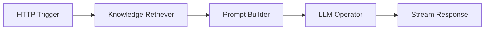

# AWEL Flow

Build AI workflows visually using the AWEL Flow editor — a drag-and-drop interface for composing LLM pipelines without writing code.

## What is AWEL Flow?

AWEL Flow is the visual editor for **AWEL (Agentic Workflow Expression Language)**. It lets you:

- Drag and drop operators onto a canvas
- Connect them into a DAG (Directed Acyclic Graph)
- Configure each operator's parameters
- Test and deploy workflows

:::info Code vs Visual
AWEL workflows can be built both in Python code and visually in the Flow editor. The Flow editor generates the same underlying DAG structure.
:::

## Getting started

### Step 1 — Open the Flow editor

1. Navigate to **Flow** in the sidebar
2. Click **Create** to start a new workflow

### Step 2 — Add operators

The left panel shows available operators organized by category:

| Category | Examples |
|---|---|
| **Trigger** | HTTP Trigger, Schedule Trigger |
| **LLM** | LLM Operator, Streaming LLM |
| **RAG** | Knowledge Retriever, Reranker |
| **Agent** | Agent Operator, Planning |
| **Data** | Database Query, File Reader |
| **Transform** | Text Splitter, JSON Parser |
| **Output** | Response, Stream Response |

Drag an operator from the palette onto the canvas.

### Step 3 — Connect operators

Click and drag from an operator's output port to another operator's input port to create a connection. Data flows along these connections.

### Step 4 — Configure operators

Click on any operator to open its configuration panel. Set parameters like:

- Model name
- Prompt templates
- Database connections
- Chunk sizes
- Custom logic

### Step 5 — Test and save

1. Click **Run** to test your workflow with sample input
2. Review the output at each stage
3. Click **Save** to persist the workflow

## Example: Simple RAG workflow

A basic RAG workflow connects these operators:



1. **HTTP Trigger** — Receives the user's question
2. **Knowledge Retriever** — Searches the knowledge base for relevant chunks
3. **Prompt Builder** — Combines the question with retrieved context
4. **LLM Operator** — Generates the answer
5. **Stream Response** — Returns the streaming response

## Using flows in apps

Created workflows can be used as the backend for applications:

1. Save your workflow in the Flow editor
2. Go to **Apps** → **Create**
3. Select the saved flow as the app's execution engine
4. The app inherits the flow's inputs and outputs

## Managing flows

| Action | How |
|---|---|
| **Edit** | Open a flow and modify operators/connections |
| **Duplicate** | Create a copy of an existing flow |
| **Export** | Download the flow definition as JSON |
| **Import** | Upload a flow definition JSON file |
| **Delete** | Remove a flow from the list |

## Installing community operators

Community operators from the [dbgpts repository](https://github.com/eosphoros-ai/dbgpts) automatically appear in the Flow editor after installation:

```bash
dbgpts install <operator-package>
```

## Next steps

| Topic | Link |
|---|---|
| AWEL concepts | [AWEL](/docs/getting-started/concepts/awel) |
| AWEL Python tutorial | [AWEL Tutorial](/docs/awel/tutorial) |
| AWEL cookbook | [AWEL Cookbook](/docs/awel/cookbook) |
| Community operators | [dbgpts](/docs/getting-started/tools/dbgpts) |
