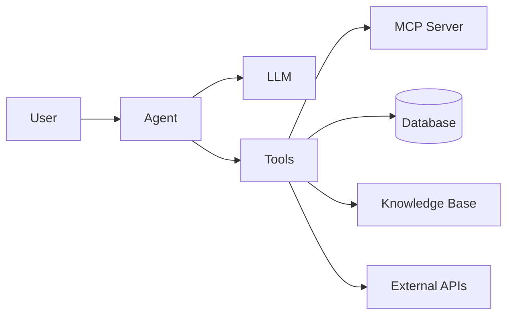

# Tools & Plugins

Extend DB-GPT with external tools, community packages, and visual workflow building.

- [MCP Protocol](/docs/getting-started/tools/mcp) — connect external tools and services to agents
- [dbgpts Ecosystem](/docs/getting-started/tools/dbgpts) — install community apps, operators, workflows, and agents
- [AWEL Flow](/docs/getting-started/tools/awel-flow) — build workflows visually in the Web UI

## Overview

DB-GPT supports three main extension mechanisms:

| Mechanism | What it does | When to use |
|---|---|---|
| **MCP Protocol** | Connects external tools (APIs, services) to agents | Need agents to call external services |
| **dbgpts** | Install pre-built apps, operators, and workflows | Want ready-made components |
| **AWEL Flow** | Visually compose AI pipelines | Need custom workflows without writing code |

## How tools work with agents

Agents in DB-GPT can use tools to:

1. **Access data** — Query databases, search knowledge bases
2. **Call APIs** — Interact with external services via MCP
3. **Execute code** — Run Python code in sandboxed environments
4. **Manage files** — Read, write, and process files

## Quick links

| Topic | Link |
|---|---|
| AWEL concepts | [AWEL](/docs/getting-started/concepts/awel) |
| Agent framework | [Agents](/docs/getting-started/concepts/agents) |
| Agent development | [Development Guide](/docs/agents/introduction/tools) |
