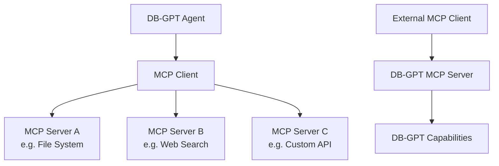

# MCP Protocol

The **Model Context Protocol (MCP)** enables DB-GPT agents to connect with external tools and services through a standardized interface.

:::info What is MCP?
MCP is an open protocol that provides a standard way for AI applications to connect with external data sources and tools. DB-GPT supports MCP as both a **client** (consuming MCP tools) and a **server** (exposing DB-GPT capabilities as MCP tools).
:::

## Architecture



## Using MCP tools in agents

### Step 1 — Configure MCP servers

MCP servers are configured in your TOML config file or through the Web UI's agent configuration.

**Example TOML configuration:**

```toml
[[agent.mcp_servers]]
name = "filesystem"
command = "npx"
args = ["-y", "@modelcontextprotocol/server-filesystem", "/path/to/directory"]

[[agent.mcp_servers]]
name = "web-search"
command = "npx"
args = ["-y", "@modelcontextprotocol/server-brave-search"]
env = { BRAVE_API_KEY = "${env:BRAVE_API_KEY}" }
```

### Step 2 — Assign tools to agents

In the Web UI:

1. Go to **Apps** → create or edit an app
2. In the agent configuration, select available MCP tools
3. The agent can now use these tools during conversations

### Step 3 — Use in chat

When chatting with an MCP-enabled agent, the agent automatically selects and invokes the appropriate tools based on your request.

## Supported MCP server types

| Type | Description | Example |
|---|---|---|
| **stdio** | Local process communication | File system access, code execution |
| **SSE** | Server-Sent Events over HTTP | Remote APIs, cloud services |

## Common MCP servers

| Server | Purpose | Package |
|---|---|---|
| Filesystem | Read/write local files | `@modelcontextprotocol/server-filesystem` |
| Brave Search | Web search | `@modelcontextprotocol/server-brave-search` |
| GitHub | Repository operations | `@modelcontextprotocol/server-github` |
| PostgreSQL | Database queries | `@modelcontextprotocol/server-postgres` |
| Slack | Send/read Slack messages | `@modelcontextprotocol/server-slack` |

:::tip Finding MCP servers
Browse the growing ecosystem of MCP servers at the [MCP Servers Directory](https://github.com/modelcontextprotocol/servers).
:::

## DB-GPT as an MCP server

DB-GPT can also expose its capabilities as an MCP server, allowing other MCP-compatible applications to use DB-GPT features like:

- Knowledge base queries
- Database access (Text2SQL)
- Agent execution

## Next steps

| Topic | Link |
|---|---|
| Agent concepts | [Agents](/docs/getting-started/concepts/agents) |
| Agent development with tools | [Tools Development](/docs/agents/introduction/tools) |
| dbgpts community tools | [dbgpts](/docs/getting-started/tools/dbgpts) |
