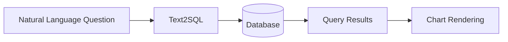

# Dashboard

Create data visualizations and reports using natural language. DB-GPT converts your questions into SQL queries and renders the results as interactive charts.

## How it works



1. You ask a question about your data in natural language
2. DB-GPT generates the appropriate SQL query
3. The query runs against your connected database
4. Results are rendered as charts, tables, or reports

## Getting started

### Prerequisites

- A database connected to DB-GPT (see [Data Sources](/docs/getting-started/concepts/data-sources))
- Test data loaded (optional — use the built-in examples)

### Using the Dashboard

1. Navigate to **Chat** in the sidebar
2. Select **Chat Dashboard** mode (or start a Dashboard conversation)
3. Choose your target database from the dropdown
4. Ask a question about your data

**Example questions:**

```
Show me monthly sales trends as a line chart
What are the top 5 products by revenue? Show as a bar chart
Create a pie chart of customer distribution by region
```

## Chart types

DB-GPT's visualization engine ([GPT-Vis](https://github.com/eosphoros-ai/GPT-Vis)) supports:

| Chart Type | Best For |
|---|---|
| **Bar Chart** | Comparing categories |
| **Line Chart** | Trends over time |
| **Pie Chart** | Proportions and distributions |
| **Table** | Detailed data display |
| **Scatter Plot** | Correlations between variables |
| **Area Chart** | Cumulative trends |

:::tip Guiding visualization
Include the desired chart type in your question for more precise results: *"Show monthly revenue as a line chart"*.
:::

## Loading test data

DB-GPT includes sample data for testing:

```bash
# Linux / macOS
bash ./scripts/examples/load_examples.sh

# Windows
.\scripts\examples\load_examples.bat
```

This loads sample datasets into SQLite that you can query immediately.

## Tips for better results

- **Be specific** — "Show the total order amount per month for 2024" works better than "Show me some data"
- **Name the chart type** — Mention "bar chart", "line chart", etc. for targeted visualizations
- **Reference column names** — If you know the schema, use actual column names for precision
- **Iterate** — Refine your question based on the initial results

## Next steps

| Topic | Link |
|---|---|
| Connect more databases | [Data Sources](/docs/getting-started/concepts/data-sources) |
| Chat modes overview | [Chat](/docs/getting-started/web-ui/chat) |
| Text2SQL fine-tuning | [Fine-Tuning](/docs/application/fine_tuning_manual/text_to_sql) |
