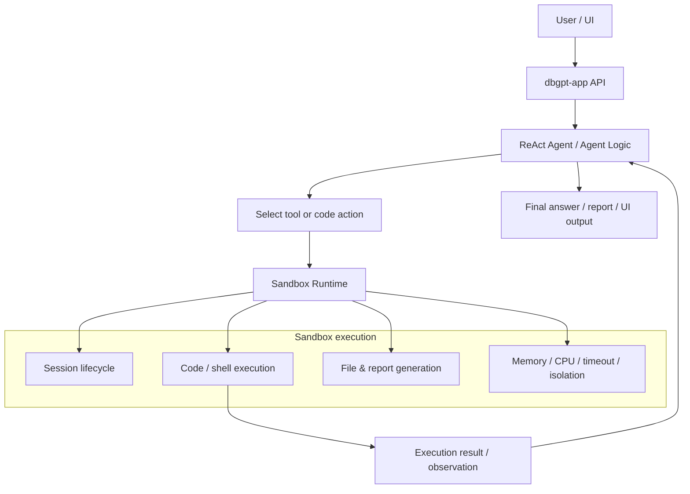
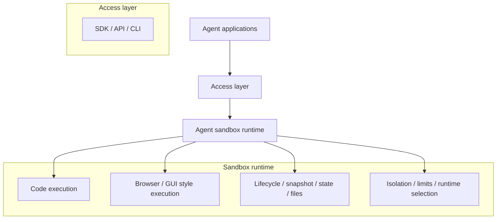

# Sandbox Overview

DB-GPT uses a sandbox to let agents execute code and tools in an isolated runtime
instead of running directly in the host environment.

This matters for agent workflows because an agent often needs to do more than
reason in text. It may need to run code, execute shell commands, install
dependencies, generate files, and keep execution state across multiple steps.

The sandbox is the execution boundary that makes those actions safer and more
manageable.

## What is a sandbox?

In DB-GPT, a sandbox is an isolated execution environment used by an agent when it
needs to execute code, run commands, or manipulate files as part of a task.

Instead of letting the agent operate directly on the host system, the sandbox
provides:

- process isolation
- resource limits
- controlled working directories
- optional dependency installation
- session lifecycle management
- a clear boundary between reasoning and execution

## How the sandbox works with agents

The agent decides **what** to do next. The sandbox executes **how** that action is
run.

## Why agents need a sandbox

An agent that can execute code without isolation is difficult to operate safely in
real environments. The sandbox gives DB-GPT a dedicated runtime for actions such
as:

- code execution
- shell command execution
- dependency installation
- file creation and retrieval
- multi-step stateful analysis

This is especially important for data analysis, report generation, and tool-driven
workflows where the agent must combine reasoning with real execution.

## DB-GPT's current sandbox solution

DB-GPT's sandbox implementation lives in:

- `packages/dbgpt-sandbox/`

The current design is a layered, extensible sandbox runtime with multiple backend
options.

### Runtime backends

The runtime factory automatically chooses the best available backend in this order:

- Docker
- Podman
- Nerdctl
- Local runtime

Implementation anchor:

- `packages/dbgpt-sandbox/src/dbgpt_sandbox/sandbox/execution_layer/runtime_factory.py`

This allows DB-GPT to prefer container isolation when available and fall back to a
local execution mode for development or environments without container support.

## Layered architecture in `dbgpt-sandbox`

DB-GPT's sandbox is implemented as a small runtime system with several layers.

### 1. Execution layer

The execution layer provides the runtime implementations and the core abstractions.

- `base.py` defines shared runtime/session/result/config interfaces
- `docker_runtime.py`, `podman_runtime.py`, `nerdctl_runtime.py`, `local_runtime.py`
  implement concrete runtimes
- `runtime_factory.py` selects the runtime backend

### 2. Control layer

The control layer manages task lifecycle and execution orchestration.

Implementation anchor:

- `packages/dbgpt-sandbox/src/dbgpt_sandbox/sandbox/control_layer/control_layer.py`

This layer handles operations such as:

- connect
- configure
- execute
- status
- disconnect
- get file

It also manages session creation and session-scoped execution.

### 3. User layer

The user layer exposes the sandbox service interface used by callers.

Implementation anchors:

- `packages/dbgpt-sandbox/src/dbgpt_sandbox/sandbox/user_layer/service.py`
- `packages/dbgpt-sandbox/src/dbgpt_sandbox/sandbox/user_layer/schemas.py`

### 4. Display layer

The display layer packages outputs for runtime-specific display or file-oriented
results.

Implementation anchor:

- `packages/dbgpt-sandbox/src/dbgpt_sandbox/sandbox/display_layer/display_layer.py`

## Session model and stateful execution

One important part of the DB-GPT sandbox design is that it supports **session-based
stateful execution**.

That means:

- a sandbox session can be created once
- multiple execution steps can run in the same session
- installed dependencies can remain available in later steps
- files produced in one step can be reused in the next step

This is important for agent workflows where a task is solved through multiple
reasoning and execution rounds rather than a single tool call.

## Current integration in DB-GPT app

Today, DB-GPT already uses sandbox execution in application-side agent tooling.

For example, the `shell_interpreter` tool in:

- `packages/dbgpt-app/src/dbgpt_app/openapi/api_v1/agentic_data_api.py`

uses `dbgpt-sandbox` `LocalRuntime` to execute shell commands with:

- process isolation
- memory limits
- timeout limits
- security validation

The current implementation there is **stateless per call** for shell execution: each
tool call creates a temporary sandbox session and destroys it after completion.

So the repo currently contains both:

- a more complete `dbgpt-sandbox` design for reusable sandbox sessions
- a practical app-side integration already using sandboxed execution for tools

## What DB-GPT supports today

Based on the current `dbgpt-sandbox` implementation, DB-GPT is moving toward a
general-purpose agent runtime that supports:

- multi-runtime sandbox execution
- safe code and shell execution
- stateful sandbox sessions
- dependency installation inside the sandbox
- task lifecycle control
- file retrieval from sandbox sessions

This makes the sandbox suitable for agent scenarios such as:

- code agents
- data analysis agents
- report generation agents
- browser/computer style execution runtimes in future extensions

## High-level view of the current DB-GPT sandbox direction

This diagram is conceptual. It shows the direction of the sandbox as a dedicated
runtime layer under agent applications, while the current repo implementation
already provides the execution, control, session, and runtime selection foundations
in `dbgpt-sandbox`.

## Key implementation anchors

- `packages/dbgpt-sandbox/README.md`
- `packages/dbgpt-sandbox/src/docs/architecture.md`
- `packages/dbgpt-sandbox/src/docs/usage.md`
- `packages/dbgpt-sandbox/src/dbgpt_sandbox/sandbox/execution_layer/runtime_factory.py`
- `packages/dbgpt-sandbox/src/dbgpt_sandbox/sandbox/control_layer/control_layer.py`
- `packages/dbgpt-app/src/dbgpt_app/openapi/api_v1/agentic_data_api.py`
