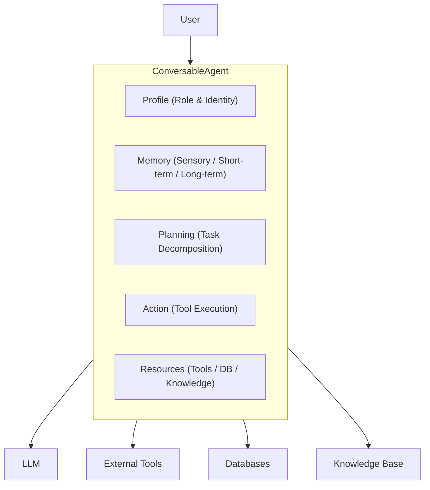

# Agent 框架

DB-GPT 提供了一个**数据驱动的多智能体框架**，用于构建能够协作、调用工具、访问数据库，并在多轮会话中保持记忆的自治 AI agent。

## Agent 架构



DB-GPT 中的每个 agent 都围绕五个核心模块构建：

| 模块 | 作用 |
|---|---|
| **Profile** | 定义 agent 的角色、名称、目标和约束 |
| **Memory** | 存储会话历史与已学习信息 |
| **Planning** | 将复杂任务拆分为可执行步骤 |
| **Action** | 执行工具调用、查询和其他动作 |
| **Resource** | 提供对工具、数据库、知识库的访问 |

## 关键概念

### ConversableAgent

所有 agent 的基础类。它实现了完整的会话循环：接收消息、思考（规划）、执行动作、返回响应。

### 多智能体协作

多个 agent 可以共同完成复杂任务：

- **Sequential** —— 多个 agent 按顺序传递结果
- **Parallel** —— 多个 agent 同时处理子任务
- **Manager-Worker** —— 由规划型 agent 把任务分发给专业 agent

### 记忆类型

| 记忆类型 | 范围 | 持久化 |
|---|---|---|
| **Sensory** | 当前消息 | 无 |
| **Short-term** | 当前会话 | Session |
| **Long-term** | 跨会话 | Database |
| **Hybrid** | 组合以上三种 | 混合 |

### 内置 agent 类型

DB-GPT 内置了多种预定义 agent：

- **Data Analysis Agent** —— 数据分析、SQL 生成、图表创建
- **Summary Agent** —— 长文档与会话摘要
- **Code Agent** —— 代码生成与执行
- **Chat Agent** —— 通用对话型 agent

## 快速示例

```python
from dbgpt.agent import ConversableAgent, AgentContext

# 定义一个简单的自定义 agent
agent = ConversableAgent(
    name="DataAnalyst",
    role="You are a data analysis expert",
    goal="Help users analyze data and generate insights",
    llm_config={"model": "chatgpt_proxyllm"},
)

# 发起一次对话
result = await agent.a_send("Analyze the sales trends for Q4 2024")
```

## 下一步

- [Agent Introduction](/docs/agents/introduction/) —— 更完整的 agent 框架说明
- [Custom Agents](/docs/agents/introduction/custom_agents) —— 自定义 agent 开发
- [Agent Tools](/docs/agents/introduction/tools) —— 将 agent 连接到工具
- [Agent Planning](/docs/agents/introduction/planning) —— 任务分解与规划策略
