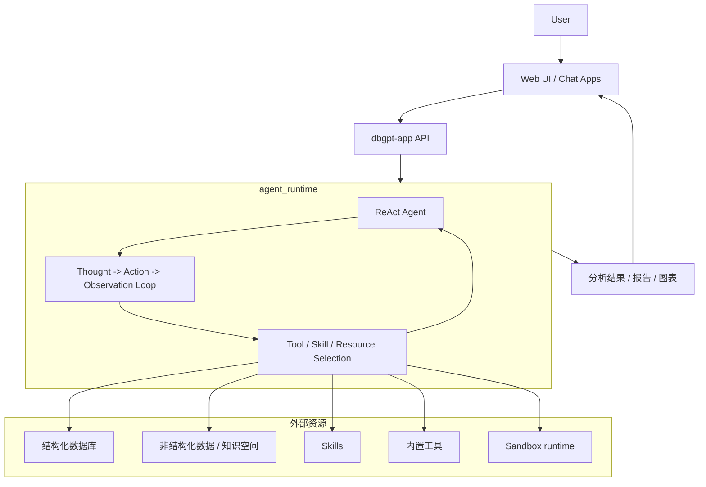

# 架构

DB-GPT 是一个 Python 单体仓库（monorepo），其整体运行方式围绕以 ReAct 为中心的 agent runtime 展开。
Web UI 将请求发送到应用层，ReAct Agent 在 agent runtime 循环中执行，并通过工具、技能、数据库与知识资源完成分析任务，最终将结果返回到 UI。

## 仓库结构

```text
DB-GPT/
├── packages/
│   ├── dbgpt-core/        # 核心 agent、memory、planning、RAG、模型抽象
│   ├── dbgpt-app/         # 应用服务、API 路由、场景逻辑、UI 资源托管
│   ├── dbgpt-serve/       # 服务层：knowledge、flow、agent resource、app service
│   ├── dbgpt-ext/         # 扩展能力：datasource、storage backend、RAG connector
│   ├── dbgpt-client/      # Python 客户端 SDK
│   ├── dbgpt-sandbox/     # 安全代码/工具执行的沙箱运行时
│   └── dbgpt-accelerator/ # 加速相关包
├── web/                   # Next.js Web UI
├── skills/                # 内置 skills 与可复用工作流
├── configs/               # TOML 配置文件
└── docs/                  # Docusaurus 文档站
```

## 各个 package 的职责

| Package | 作用 |
|---|---|
| `dbgpt-core` | 核心 agent 框架、ReAct 解析/动作流、memory、planning、RAG、模型接口 |
| `dbgpt-app` | FastAPI 应用服务、聊天 API、运行时编排、静态 UI 托管 |
| `dbgpt-serve` | knowledge、datasource、flow、app、agent 等资源服务 |
| `dbgpt-ext` | 外部连接器，例如数据库 / 存储 / RAG 集成 |
| `dbgpt-client` | DB-GPT API 的客户端 SDK |
| `dbgpt-sandbox` | 代码与工具执行的隔离运行时 |
| `skills/` | 打包后的领域工作流、脚本、模板和参考资源 |

## 高层架构



## 工作流程

1. 用户通过 Web UI 或其他客户端发起请求。
2. `dbgpt-app` 接收请求，并将其路由到 agent 聊天 API。
3. 请求进入 `agent_runtime` 执行循环。
4. ReAct Agent 逐步推理，并决定下一步动作。
5. Agent 按需加载并使用外部资源：
   - 结构化数据库：用于 SQL 分析
   - 非结构化知识空间：用于检索增强
   - skills：用于复用工作流
   - 内置工具：用于执行具体任务
   - sandbox runtime：用于安全代码执行
6. Agent 汇总观察结果，并生成最终分析输出。
7. 结果以流式方式返回到 UI 展示给用户。

## Agent runtime 模型

runtime 是驱动 ReAct 循环的概念性执行层。
在代码层面，它通过 agent builder、resource manager、ReAct parser / action flow，以及与 UI 相连的 API streaming handler 共同实现。

关键实现锚点：

- `packages/dbgpt-core/src/dbgpt/agent/expand/react_agent.py`
- `packages/dbgpt-core/src/dbgpt/agent/util/react_parser.py`
- `packages/dbgpt-app/src/dbgpt_app/openapi/api_v1/agentic_data_api.py`
- `web/hooks/use-react-agent-chat.ts`
- `packages/dbgpt-sandbox/src/dbgpt_sandbox/sandbox/execution_layer/runtime_factory.py`

## Agent 会使用哪些资源

### 结构化数据

数据库和可查询的表格型数据源主要用于 SQL 分析、schema linking 和报表生成。

### 非结构化数据

知识空间和文档集合为非结构化内容提供检索支持。

### Skills

内置 skills 将可复用的流程打包成可重复执行的任务单元，agent 可以在会话中按需加载和执行。

### 内置工具

工具包括 SQL 执行、shell / 代码执行、HTML 渲染、搜索，以及其他通过 resource manager 注册的任务型操作。

## 结果如何交付给用户

最终输出路径是面向用户的：

`ReAct Agent` → `agent_runtime` → `streamed result` → `Web UI`

这种架构非常适合交互式数据分析、报表生成以及借助工具完成的复杂推理任务。
