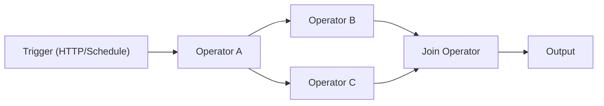

# AWEL (Agentic Workflow Expression Language)

AWEL 是一个专门用于构建 LLM 应用工作流的领域特定语言。它允许你使用一组内置 operator，将复杂 AI 流水线组织成 **有向无环图（DAG）**。

## 为什么使用 AWEL？

传统 LLM 应用开发往往充满零散 API 调用、脆弱胶水代码和难以维护的流程。AWEL 通过以下方式解决这些问题：

- **声明式 DAG** —— 描述流程要做什么，而不是手工拼接执行细节
- **可复用 operator** —— 可以组合内置或自定义 operator
- **原生流式支持** —— 更适合实时响应场景
- **可视化编辑器** —— 在 Web UI 中通过 AWEL Flow 进行无代码编排

## 工作原理



一个 AWEL 流程通常由以下部分组成：

1. **Trigger** —— 入口（HTTP 请求、定时任务或手动触发）
2. **Operators** —— 负责处理和转换数据的节点
3. **DAG** —— 将 Trigger 和 Operators 连接起来的图结构

## 核心 operator

| Operator | 描述 | 适用场景 |
|---|---|---|
| **MapOperator** | 对每个输入项做转换 | 数据格式化、API 调用 |
| **ReduceOperator** | 聚合多个输入为一个结果 | 摘要、汇总 |
| **JoinOperator** | 合并并行分支结果 | 多源聚合 |
| **BranchOperator** | 根据条件路由到不同路径 | 条件分支逻辑 |
| **StreamifyOperator** | 将 batch 转为 stream | 实时处理 |
| **UnstreamifyOperator** | 将 stream 转回 batch | 收集流式结果 |
| **TransformStreamOperator** | 转换流中的每个元素 | 流式过滤 / 映射 |
| **InputOperator** | 提供 DAG 的初始输入 | 流程入口数据 |

## 快速示例

下面是一个最小 AWEL 示例：接收用户问题并生成 LLM 回复。

```python
from dbgpt.core.awel import DAG, MapOperator, InputOperator

with DAG("simple_chat") as dag:
    input_node = InputOperator(input_source="user_question")
    llm_node = MapOperator(map_function=call_llm)
    input_node >> llm_node
```

## AWEL Flow（可视化编辑器）

Web UI 中包含拖拽式 AWEL Flow 编辑器，你可以：

- 通过连接 operator 节点可视化构建工作流
- 在侧边栏中配置每个 operator 参数
- 实时测试和调试 flow
- 保存并分享流程模板

你可以从 Web UI 侧边栏中的 **AWEL Flow** 入口打开它。

## 下一步

- [AWEL Tutorial](/docs/awel/tutorial) —— 分步骤学习路径
- [AWEL Cookbook](/docs/awel/cookbook) —— 常见场景实践示例
- [AWEL Flow Usage](/docs/application/awel) —— 可视化编辑器使用方式
