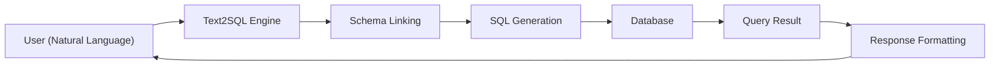

# 数据源

DB-GPT 可以连接多种数据源，让你通过自然语言与数据库、电子表格和数据仓库交互。

## 支持的数据源

| 数据源 | 类型 | 状态 |
|---|---|---|
| **SQLite** | Relational | Built-in (default) |
| **MySQL** | Relational | Supported |
| **PostgreSQL** | Relational | Supported |
| **ClickHouse** | OLAP | Supported |
| **DuckDB** | Analytical | Supported |
| **MSSQL** | Relational | Supported |
| **Oracle** | Relational | Supported |
| **Excel** | Spreadsheet | Supported |
| **CSV** | Flat file | Supported |

## 工作原理

1. **用户** 用自然语言提问
2. **Text2SQL** 引擎分析问题与关联 schema
3. 根据问题上下文生成 **SQL**
4. **数据库** 执行查询
5. **结果** 被格式化并返回（可选图表）

## 添加数据源

### 通过 Web UI

1. 打开 DB-GPT Web UI
2. 在侧边栏进入 **Data Sources**
3. 点击 **Add Data Source**
4. 选择数据库类型并填写连接信息
5. 测试连接并保存

### 通过配置

数据源连接也可以直接在 TOML 配置文件中设置，或者通过 REST API 管理。

## Text2SQL

DB-GPT 擅长将自然语言转换为 SQL 查询：

- **Schema linking** —— 自动将自然语言映射到表名和字段名
- **多轮对话** —— 通过追问逐步修正查询
- **图表生成** —— 将查询结果可视化为图表和 dashboard
- **微调** —— 针对特定业务域提升 Text2SQL 准确率

:::tip
为了获得更好的 Text2SQL 效果，建议数据库表名、字段名和注释都尽量语义清晰。
:::

## 下一步

- [Chat DB](/docs/application/apps/chat_db) —— 与数据库对话
- [Chat Excel](/docs/application/apps/chat_excel) —— 与 Excel 文件对话
- [Chat Dashboard](/docs/application/apps/chat_dashboard) —— 生成数据看板
- [Datasource Integrations](/docs/installation/integrations) —— 安装更多连接器
- [Connections Module](/docs/modules/connections) —— 深入理解数据源管理机制
