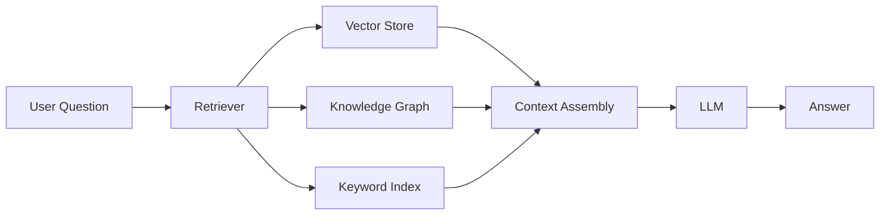
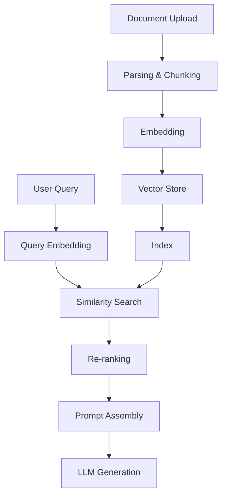

# RAG (Retrieval-Augmented Generation)

RAG 会在生成答案之前，先从你的数据中检索相关上下文，从而增强 LLM 的回答效果。DB-GPT 提供了完整的 RAG 框架，并支持多种检索策略。

## RAG 如何工作

1. **用户提出问题**
2. **Retriever** 到知识库中检索相关文档
3. **Context** 由检索到的片段组装而成
4. **LLM** 基于检索上下文生成答案

## 知识库类型

DB-GPT 默认支持多种知识库类型：

| 类型 | 存储方式 | 适合场景 |
|---|---|---|
| **Vector** | ChromaDB、Milvus、OceanBase | 语义相似度检索 |
| **Knowledge Graph** | TuGraph、Neo4j | 实体关系、结构化问答 |
| **Keyword (BM25)** | 内置实现 | 精确关键词匹配 |
| **Hybrid** | 组合多种方式 | 综合检索效果 |

## 支持的文件格式

可上传并处理多种文档格式：

- **文档**：PDF、Word（.docx）、Markdown、TXT
- **表格**：Excel（.xlsx）、CSV
- **网页**：HTML、URL
- **代码**：Python、Java 等源码文件

## RAG 流程

DB-GPT 中完整的 RAG 流程如下：

### 关键步骤

1. **Parsing** —— 从上传文档中提取文本
2. **Chunking** —— 将文本切分成可管理的小段
3. **Embedding** —— 把文本片段转成向量表示
4. **Storage** —— 将向量存入向量数据库
5. **Retrieval** —— 针对查询检索相关片段
6. **Re-ranking** —— 可选地对结果重排以提高相关性
7. **Generation** —— 将上下文与问题一起输入 LLM

## 快速开始使用 RAG

1. 打开 DB-GPT Web UI
2. 在侧边栏进入 **Knowledge Base**
3. 创建一个新的知识库
4. 上传你的文档
5. 等待处理完成
6. 开始基于知识库对话

如果你想通过编程方式使用，请参考 [RAG Cookbook](/docs/cookbook/rag/graph_rag_app_develop)。

## 下一步

- [Knowledge Base UI](/docs/getting-started/web-ui/knowledge-base) —— 在 Web UI 中管理知识库
- [Graph RAG](/docs/application/graph_rag) —— 基于图谱的检索方式
- [RAG Module](/docs/modules/rag) —— 深入理解 RAG 框架
- [RAG Development Guide](/docs/cookbook/rag/graph_rag_app_develop) —— 以编程方式构建 RAG 应用
