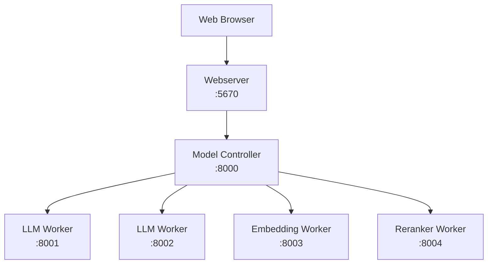

# 集群部署

将 DB-GPT 部署为分布式集群，将 webserver、model worker 和 controller 拆分开来，以提升扩展性。

## 架构概览



| 组件 | 角色 | 默认端口 |
|---|---|---|
| **Controller** | 服务注册与路由 | 8000 |
| **LLM Worker** | 提供语言模型服务 | 8001+ |
| **Embedding Worker** | 提供 Embedding 模型服务 | 8003+ |
| **Reranker Worker** | 提供重排模型服务 | 8004+ |
| **API Server** | REST API 网关（可选） | 8100 |
| **Webserver** | Web UI 与应用逻辑 | 5670 |

## 方式 A：手动集群部署（CLI）

### 第一步：启动 controller

```bash
dbgpt start controller
```

Controller 默认监听 `8000` 端口。

### 第二步：启动 LLM Worker

```bash
dbgpt start worker \
  --model_name glm-4-9b-chat \
  --model_path /app/models/glm-4-9b-chat \
  --port 8001 \
  --controller_addr http://127.0.0.1:8000
```

你也可以在不同端口上启动更多 worker：

```bash
dbgpt start worker \
  --model_name vicuna-13b-v1.5 \
  --model_path /app/models/vicuna-13b-v1.5 \
  --port 8002 \
  --controller_addr http://127.0.0.1:8000
```

:::info
请将模型名称和路径替换为你自己的配置。每个 worker 都必须使用唯一端口。
:::

### 第三步：启动 Embedding Worker

```bash
dbgpt start worker \
  --model_name text2vec \
  --model_path /app/models/text2vec-large-chinese \
  --worker_type text2vec \
  --port 8003 \
  --controller_addr http://127.0.0.1:8000
```

### 第四步：启动 Reranker Worker（可选）

```bash
dbgpt start worker \
  --worker_type text2vec \
  --rerank \
  --model_name bge-reranker-base \
  --model_path /app/models/bge-reranker-base \
  --port 8004 \
  --controller_addr http://127.0.0.1:8000
```

### 第五步：验证已部署模型

```bash
dbgpt model list
```

预期输出：

```
+-------------------+------------+------+---------+
|    Model Name     | Model Type | Port | Healthy |
+-------------------+------------+------+---------+
|   glm-4-9b-chat   |    llm     | 8001 |   True  |
|  vicuna-13b-v1.5  |    llm     | 8002 |   True  |
|     text2vec      |  text2vec  | 8003 |   True  |
| bge-reranker-base |  text2vec  | 8004 |   True  |
+-------------------+------------+------+---------+
```

### 第六步：启动 webserver

```bash
LLM_MODEL=glm-4-9b-chat \
MODEL_SERVER=http://127.0.0.1:8000 \
dbgpt start webserver --light --remote_embedding
```

| 参数 | 作用 |
|---|---|
| `--light` | 不启动内嵌模型服务 |
| `--remote_embedding` | 使用远程 Embedding Worker |

---

## 方式 B：Docker Compose 集群部署

使用预置好的集群 Compose 文件：

```bash
docker compose -f docker/compose_examples/cluster-docker-compose.yml up -d
```

该方式会启动：

- **Controller**：服务注册中心
- **LLM Worker**：在 GPU 上运行 `glm-4-9b-chat`
- **Embedding Worker**：在 GPU 上运行 `text2vec-large-chinese`
- **Webserver**：以轻量模式运行 Web UI

:::warning
运行前请先编辑 Compose 文件，设置你的模型路径。默认路径为 `/data/models/`。
:::

### 高可用集群

如果要部署带多个 controller 的高可用集群：

```bash
docker compose -f docker/compose_examples/ha-cluster-docker-compose.yml up -d
```

## CLI 参考

<details>
<summary><strong>dbgpt start worker --help</strong></summary>

关键参数：

| 参数 | 说明 | 默认值 |
|---|---|---|
| `--model_name` | 模型名称（必填） | — |
| `--model_path` | 模型文件路径（必填） | — |
| `--worker_type` | Worker 类型（`llm`、`text2vec`） | `llm` |
| `--port` | Worker 端口 | 8001 |
| `--controller_addr` | Controller 地址 | — |
| `--device` | 设备类型（`cuda`、`cpu`、`mps`） | auto |
| `--num_gpus` | 使用的 GPU 数量 | all |
| `--load_8bit` | 启用 8-bit 量化 | false |
| `--load_4bit` | 启用 4-bit 量化 | false |
| `--max_context_size` | 最大上下文窗口 | 4096 |

</details>

<details>
<summary><strong>dbgpt model --help</strong></summary>

| 命令 | 说明 |
|---|---|
| `dbgpt model list` | 列出所有已注册模型实例 |
| `dbgpt model start` | 启动模型实例 |
| `dbgpt model stop` | 停止模型实例 |
| `dbgpt model restart` | 重启模型实例 |
| `dbgpt model chat` | 在 CLI 中直接与模型对话 |

</details>

## 下一步

| 主题 | 链接 |
|---|---|
| Docker 单容器部署 | [Docker](/docs/getting-started/deploy/docker) |
| Docker Compose 部署 | [Docker Compose](/docs/getting-started/deploy/docker-compose) |
| 源码部署 | [Source Code](/docs/getting-started/deploy/source-code) |
| 深入了解 SMMF | [Multi-Model Management](/docs/getting-started/concepts/smmf) |
