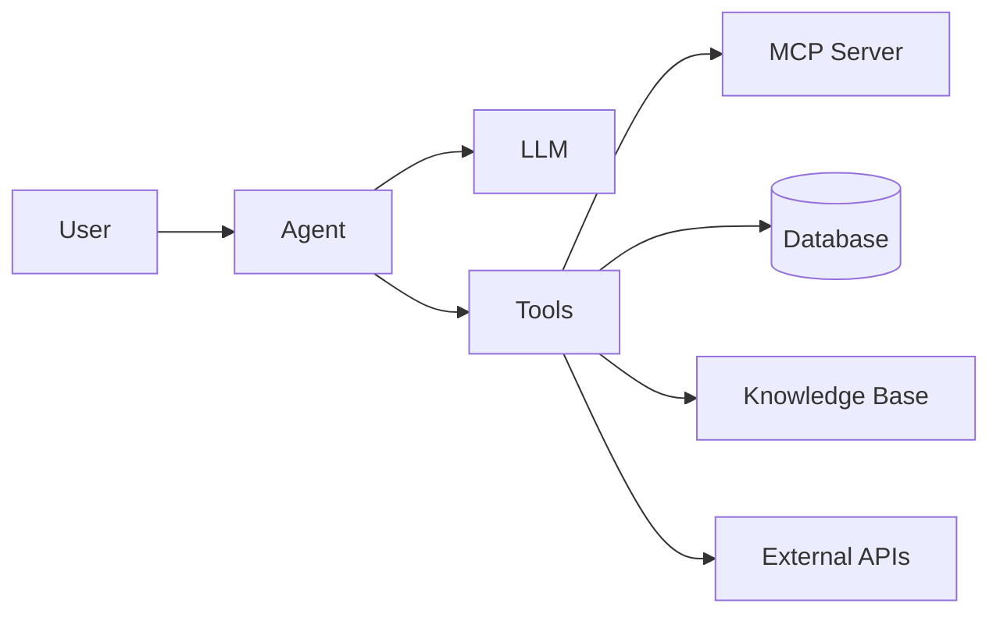

# Tools & Plugins

通过外部工具、社区包和可视化工作流扩展 DB-GPT。

- [MCP Protocol](/docs/getting-started/tools/mcp) —— 把外部工具和服务接入 agent
- [dbgpts Ecosystem](/docs/getting-started/tools/dbgpts) —— 安装社区应用、operator、workflow 和 agent
- [AWEL Flow](/docs/getting-started/tools/awel-flow) —— 在 Web UI 中可视化构建工作流

## Overview

DB-GPT 目前主要支持三种扩展机制：

| 机制 | 作用 | 适用场景 |
|---|---|---|
| **MCP Protocol** | 把外部工具（API、服务）连接到 agent | 需要让 agent 调用外部服务 |
| **dbgpts** | 安装预构建应用、operator 和 workflow | 想直接复用现成组件 |
| **AWEL Flow** | 可视化编排 AI 流程 | 想构建自定义工作流且尽量少写代码 |

## 工具如何与 agent 协同

DB-GPT 中的 agent 可以通过工具完成：

1. **访问数据** —— 查询数据库、搜索知识库
2. **调用 API** —— 通过 MCP 与外部服务交互
3. **执行代码** —— 在沙箱环境中运行 Python 代码
4. **管理文件** —— 读写和处理文件

## 快速链接

| 主题 | 链接 |
|---|---|
| AWEL 概念 | [AWEL](/docs/getting-started/concepts/awel) |
| Agent 框架 | [Agents](/docs/getting-started/concepts/agents) |
| Agent 开发 | [Development Guide](/docs/agents/introduction/tools) |
