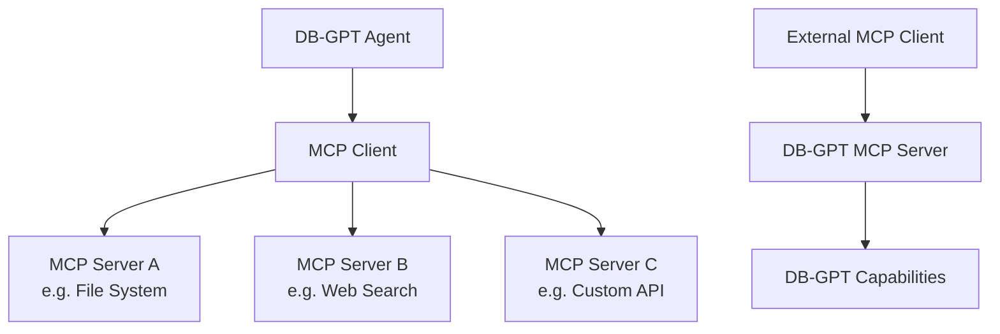

# MCP 协议

**模型上下文协议（Model Context Protocol, MCP）** 让 DB-GPT Agent 能够通过标准化接口连接外部工具与服务。

:::info 什么是 MCP？
MCP 是一个开放协议，为 AI 应用连接外部数据源和工具提供统一标准。DB-GPT 同时支持作为 **客户端**（消费 MCP 工具）和 **服务端**（将 DB-GPT 能力暴露为 MCP 工具）。
:::

## 架构



## 在 Agent 中使用 MCP 工具

### 第一步：配置 MCP Server

你可以在 TOML 配置文件中配置 MCP Server，也可以在 Web UI 的 Agent 配置中完成配置。

**TOML 配置示例：**

```toml
[[agent.mcp_servers]]
name = "filesystem"
command = "npx"
args = ["-y", "@modelcontextprotocol/server-filesystem", "/path/to/directory"]

[[agent.mcp_servers]]
name = "web-search"
command = "npx"
args = ["-y", "@modelcontextprotocol/server-brave-search"]
env = { BRAVE_API_KEY = "${env:BRAVE_API_KEY}" }
```

### 第二步：为 Agent 分配工具

在 Web UI 中：

1. 进入 **Apps**，创建或编辑一个应用
2. 在 Agent 配置中选择可用的 MCP 工具
3. 之后 Agent 就可以在对话过程中调用这些工具

### 第三步：在对话中使用

当你与启用了 MCP 的 Agent 对话时，Agent 会根据你的请求自动选择并调用合适的工具。

## 支持的 MCP Server 类型

| 类型 | 说明 | 示例 |
|---|---|---|
| **stdio** | 本地进程通信 | 文件系统访问、代码执行 |
| **SSE** | 基于 HTTP 的 Server-Sent Events | 远程 API、云服务 |

## 常见 MCP Server

| Server | 用途 | 包名 |
|---|---|---|
| Filesystem | 读写本地文件 | `@modelcontextprotocol/server-filesystem` |
| Brave Search | Web 搜索 | `@modelcontextprotocol/server-brave-search` |
| GitHub | 仓库操作 | `@modelcontextprotocol/server-github` |
| PostgreSQL | 数据库查询 | `@modelcontextprotocol/server-postgres` |
| Slack | 发送/读取 Slack 消息 | `@modelcontextprotocol/server-slack` |

:::tip 查找 MCP Server
你可以在 [MCP Servers Directory](https://github.com/modelcontextprotocol/servers) 浏览不断扩展的 MCP Server 生态。
:::

## 将 DB-GPT 作为 MCP Server

DB-GPT 也可以将自身能力暴露为 MCP Server，让其他兼容 MCP 的应用调用 DB-GPT 的能力，例如：

- 知识库查询
- 数据库访问（Text2SQL）
- Agent 执行

## 下一步

| 主题 | 链接 |
|---|---|
| Agent 概念 | [Agents](/docs/getting-started/concepts/agents) |
| 使用工具开发 Agent | [Tools Development](/docs/agents/introduction/tools) |
| dbgpts 社区工具 | [dbgpts](/docs/getting-started/tools/dbgpts) |
