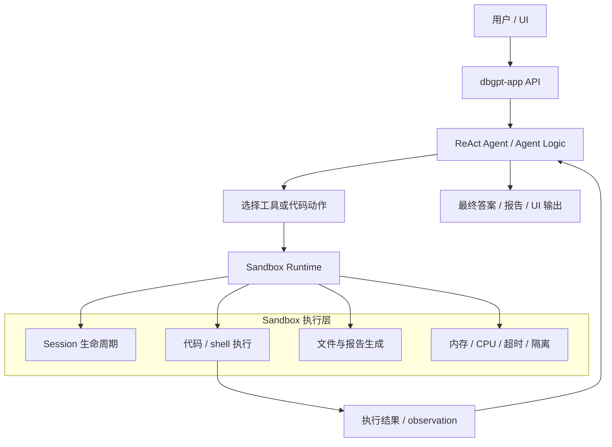
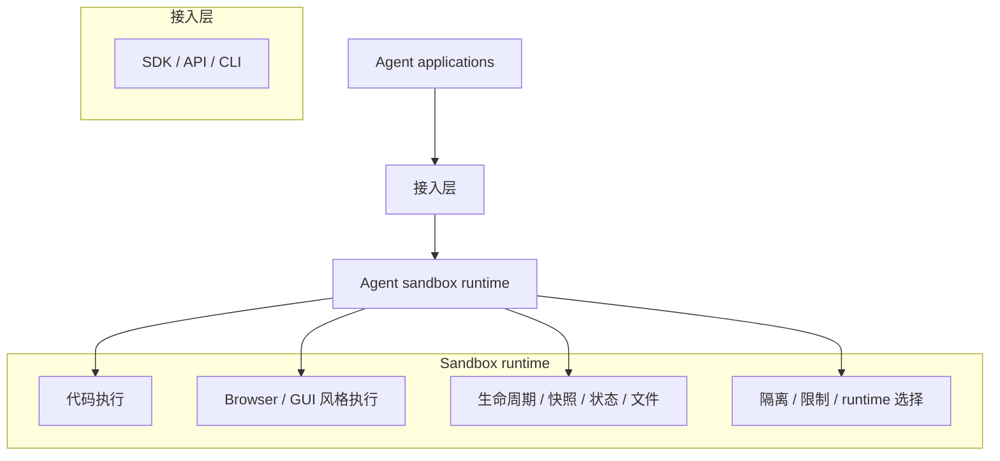

# Sandbox 总览

DB-GPT 使用 sandbox（沙箱）让智能体在隔离的运行环境中执行代码和工具，而不是直接在宿主机环境中运行。

这对 agent 工作流非常重要，因为智能体往往不仅仅需要文本推理，还需要：

- 执行代码
- 运行 shell 命令
- 安装依赖
- 生成文件
- 在多轮执行之间保持状态

Sandbox 就是把这些执行能力放在一个更安全、可控、可管理的边界内。

## 什么是 sandbox？

在 DB-GPT 中，sandbox 是一个隔离执行环境，供智能体在任务过程中执行代码、运行命令、处理文件或调用执行型工具。

它避免智能体直接操作宿主机，并提供：

- 进程隔离
- 资源限制
- 可控工作目录
- 可选依赖安装能力
- 会话生命周期管理
- 清晰的“推理”和“执行”边界

## Sandbox 如何作用于 agent

智能体负责决定**下一步做什么**，sandbox 负责安全地执行**这个动作怎么运行**。

## 为什么 agent 需要 sandbox

如果智能体可以不受限制地直接执行代码，那么在真实环境中很难安全落地。Sandbox 为 DB-GPT 提供了一个专门的执行层，用于支持：

- 代码执行
- shell 命令执行
- 依赖安装
- 文件创建与读取
- 多步骤、有状态的数据分析

这对数据分析、报表生成和工具驱动型工作流尤其重要，因为这些场景需要把推理和真实执行结合起来。

## DB-GPT 当前的 sandbox 方案

DB-GPT 当前的 sandbox 实现位于：

- `packages/dbgpt-sandbox/`

它是一个分层的、可扩展的沙箱运行时系统，支持多种 backend。

### Runtime backends

运行时工厂会按以下优先级自动选择 backend：

- Docker
- Podman
- Nerdctl
- Local runtime

实现锚点：

- `packages/dbgpt-sandbox/src/dbgpt_sandbox/sandbox/execution_layer/runtime_factory.py`

这意味着 DB-GPT 会优先使用容器隔离；如果部署环境没有容器支持，也可以退化到本地运行时用于开发或调试。

## `dbgpt-sandbox` 的分层架构

### 1. Execution layer

执行层提供具体 runtime 实现与核心抽象：

- `base.py`：定义 runtime / session / result / config 等公共接口
- `docker_runtime.py`、`podman_runtime.py`、`nerdctl_runtime.py`、`local_runtime.py`：具体运行时实现
- `runtime_factory.py`：负责自动选择 backend

### 2. Control layer

控制层负责任务生命周期与执行编排。

实现锚点：

- `packages/dbgpt-sandbox/src/dbgpt_sandbox/sandbox/control_layer/control_layer.py`

它处理的操作包括：

- connect
- configure
- execute
- status
- disconnect
- get file

同时也负责 session 创建与基于 session 的执行调度。

### 3. User layer

用户层对外暴露 sandbox 服务接口。

实现锚点：

- `packages/dbgpt-sandbox/src/dbgpt_sandbox/sandbox/user_layer/service.py`
- `packages/dbgpt-sandbox/src/dbgpt_sandbox/sandbox/user_layer/schemas.py`

### 4. Display layer

显示层用于封装运行时相关的展示结果或文件型结果。

实现锚点：

- `packages/dbgpt-sandbox/src/dbgpt_sandbox/sandbox/display_layer/display_layer.py`

## Session 模型与有状态执行

DB-GPT 当前 sandbox 设计的一个重要点，是支持**基于 session 的有状态执行**。

这意味着：

- sandbox session 可以先创建一次
- 多个执行步骤可以复用同一个 session
- 上一步安装的依赖在后续步骤中仍然可用
- 前一步生成的文件也可以在后一步继续使用

这非常适合 agent 场景，因为很多任务不是一次工具调用就完成，而是需要多轮“推理 -> 执行 -> 观察”。

## DB-GPT app 中当前的接入方式

目前 DB-GPT 已经在应用侧 agent 工具里实际使用了 sandbox。

例如：

- `packages/dbgpt-app/src/dbgpt_app/openapi/api_v1/agentic_data_api.py`

中的 `shell_interpreter` 工具，就使用了 `dbgpt-sandbox` 的 `LocalRuntime` 执行 shell 命令，并具备：

- 进程隔离
- 内存限制
- 超时限制
- 安全校验

当前这里的实现是**单次调用无状态**的：每次工具调用都会创建一个临时 sandbox session，执行结束后销毁。

因此仓库里实际上同时存在两层能力：

- `dbgpt-sandbox` 中更完整的、可复用 session 的 sandbox 设计
- `dbgpt-app` 中已经在实际工具执行里接入的 sandbox 用法

## DB-GPT 当前支持的方向

基于当前 `dbgpt-sandbox` 实现，DB-GPT 正在走向一个更通用的 agent 执行运行时，支持：

- 多 runtime 的 sandbox 执行
- 安全代码与 shell 执行
- 有状态 session
- sandbox 内依赖安装
- 任务生命周期控制
- 文件读取与产物管理

这使得 sandbox 很适合支撑：

- 代码 agent
- 数据分析 agent
- 报告生成 agent
- 未来扩展到 browser / computer 风格运行时

## 当前 DB-GPT sandbox 方向图

这张图是概念性的，表示 sandbox 作为 agent 应用之下的专门运行时层。当前仓库已经在 `dbgpt-sandbox` 中具备 execution、control、session 和 runtime selection 的基础能力。

## 关键实现锚点

- `packages/dbgpt-sandbox/README.md`
- `packages/dbgpt-sandbox/src/docs/architecture.md`
- `packages/dbgpt-sandbox/src/docs/usage.md`
- `packages/dbgpt-sandbox/src/dbgpt_sandbox/sandbox/execution_layer/runtime_factory.py`
- `packages/dbgpt-sandbox/src/dbgpt_sandbox/sandbox/control_layer/control_layer.py`
- `packages/dbgpt-app/src/dbgpt_app/openapi/api_v1/agentic_data_api.py`
